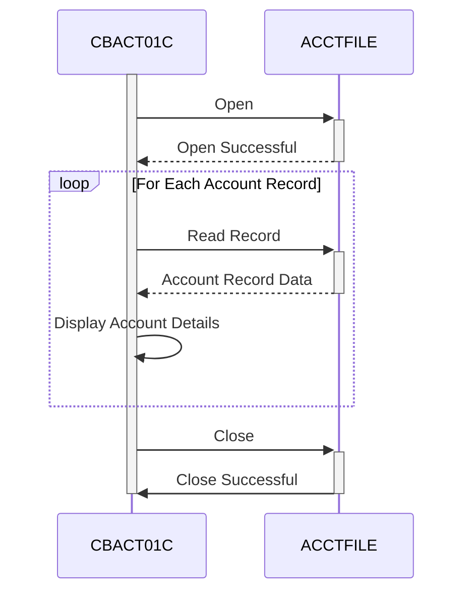

Generated at: 1st October of 2024

# **Title Document:** CardDemo Application - Account Data Batch Processing Program Specification

# **Summary Description:**

The CardDemo Account Data Batch Processing program is designed to read and display credit card account information from a secure file. This program sequentially processes each account record, presenting a summary of its details, and ensuring data integrity throughout the process. 

# **User Stories:**

As a data analyst, I need to ensure that all credit card account information is accurately processed and readily available for analysis and reporting.

# **Related Epic:** 

7 - Batch Processing

# **Functional Requirements:**

1. **File Access and Handling:**
    - The program must be able to locate and open the designated account data file (ACCTFILE).
    - It should handle the file securely, opening it for input only.
    - The program should be able to gracefully handle scenarios where the file is not found or inaccessible.

2. **Sequential Record Processing:**
    - The program should read account records one after another in the order they are stored in the file, ensuring all records are processed.
    - After processing a record, it should fetch the next available record until the end of the file is reached.

3. **Data Extraction and Display:**
    - For each account record, the program should extract relevant details, including:
        - Account ID (ACCT-ID)
        - Account Status (ACCT-ACTIVE-STATUS)
        - Current Balance (ACCT-CURR-BAL)
        - Credit Limit (ACCT-CREDIT-LIMIT)
        - Cash Credit Limit (ACCT-CASH-CREDIT-LIMIT)
        - Account Opening Date (ACCT-OPEN-DATE)
        - Account Expiration Date (ACCT-EXPIRAION-DATE)
        - Account Reissue Date (ACCT-REISSUE-DATE)
        - Current Cycle Credit (ACCT-CURR-CYC-CREDIT)
        - Current Cycle Debit (ACCT-CURR-CYC-DEBIT)
        - Account Group ID (ACCT-GROUP-ID)
    - The extracted details should be clearly displayed on the screen in a readable format.

4. **End of File Detection:**
    - The program should recognize when it has reached the end of the account data file.
    - Upon reaching the end of the file, it should stop processing and proceed to close the file.

5. **Error Handling and Reporting:**
    - The program should incorporate error handling mechanisms to gracefully manage potential issues:
        - File Open Errors: Inability to open the account data file.
        - File Read Errors: Problems encountered while reading account records.
    - When an error occurs, the program should:
        - Clearly display an error message indicating the nature of the problem.
        - Display the associated file status code for technical diagnosis.
        - Terminate gracefully, preventing further processing.

# **Non-Functional Requirements:**

1. **Performance:**
    - The program should process the account data efficiently, especially for large files, minimizing the time required for completion.

2. **Reliability:**
    - The program should operate reliably, consistently processing data and handling errors without unexpected termination.

3. **Maintainability:**
    - The program's code should be well-structured, modular, and documented to facilitate future maintenance and enhancements.

# **Acceptance Criteria:**

1. **Successful File Processing:**
    - The program should successfully open, read, and process all account records in the designated input file.
    - It should display the extracted account details from the file correctly.
2. **Accurate End of File Handling:**
    - The program should accurately detect the end of the input file and stop processing records.
    - It should close the input file gracefully after processing.
3. **Robust Error Handling:**
    - The program should gracefully handle scenarios where the input file is not found or inaccessible, displaying appropriate error messages.
    - It should manage errors during file reading, displaying relevant messages and terminating gracefully.

# **Code Improvements:**

1. **Centralized Error Handling:** Implement a centralized error handling routine to manage and log errors consistently throughout the program.
2. **Output Flexibility:** Provide options to write the processed account data to an output file or a database for persistence and further analysis.
3. **Performance Optimization:** For very large files, consider implementing optimizations such as buffered reads or parallel processing to improve performance.

# **Security Improvements:**

1. **File Access Control:** Implement access controls to restrict unauthorized access to the account data file.
2. **Data Encryption:** If the account data file contains sensitive information, consider encrypting the data to protect it from unauthorized access.
3. **Audit Logging:** Implement audit logging to track file access and processing activities for security and auditing purposes.

# **Conceptual Diagram:**

--Made by "Smart Engineering" (by Compass.UOL)--