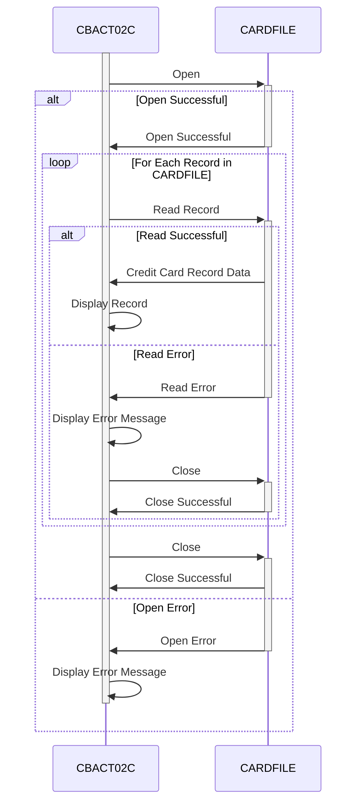

Generated at: 1st October of 2024

# **Title Document:** CardDemo Application - Card Data File Batch Processor Detailed Specification

## **Summary Description:**

This document provides a comprehensive overview of the CBACT02C program within the CardDemo application. This program is designed to read and display credit card information from a specific file (CARDFILE). It's like opening a spreadsheet containing credit card details and printing its contents.

## **User Stories:**

As a data analyst, I need to ensure that all credit card data is accurately processed so that I can perform reliable analysis and reporting.

## **Related Epic:** 
7 - Batch Processing

## **Functional Requirements:**

1. **File Access:** The program must be able to open and read data from a file named "CARDFILE".
2. **Sequential Reading:** The program should read the credit card records one after another in the order they are stored in the file.
3. **Data Display:** The program should display the content of each credit card record that is read from the file. The specific output method (e.g., screen, printer) is not defined within the provided code.
4. **Error Handling:**
    - If the program cannot open the "CARDFILE", it should display an error message indicating the issue and then stop.
    - If an error occurs while reading data from the "CARDFILE", the program should display an error message and then stop.
5. **File Closing:** The program should automatically close the "CARDFILE" after all records have been processed or if an error occurs.

## **Non-Functional Requirements:**

- **Performance:** The program should process the credit card data efficiently, especially considering potential large file sizes. 
- **Reliability:** The program should reliably read and display credit card data, ensuring data integrity throughout the process.
- **Maintainability:** The program's code should be well-structured and documented to facilitate easy maintenance and updates in the future.

## **Acceptance Criteria:**

- The program successfully opens and reads data from the "CARDFILE".
- The program displays the content of each credit card record accurately.
- The program handles file errors gracefully, displaying appropriate error messages and closing the file properly.
- The program adheres to coding standards for readability and maintainability.

## **Code Improvements:**

- **Detailed Error Logging:** Implement a more robust error handling mechanism that logs specific error details (e.g., error codes, timestamps) to a separate file. This will aid in debugging and issue resolution.
- **Output Flexibility:**  Modify the program to allow the user to specify the output destination (e.g., screen, printer, file) for the credit card data.
- **Code Modularity:**  Break down the program into smaller, reusable modules (e.g., file handling, data display) to improve code organization and readability.

## **Security Improvements:**

- **File Access Control:** Implement access control mechanisms to restrict unauthorized access to the "CARDFILE". This could involve using file permissions or other security measures provided by the operating system or security software.
- **Data Encryption:**  If the "CARDFILE" contains sensitive credit card information, consider encrypting the data at rest to protect it from unauthorized access.

## **Conceptual Diagram:**

--Made by "Smart Engineering" (by Compass.UOL)--