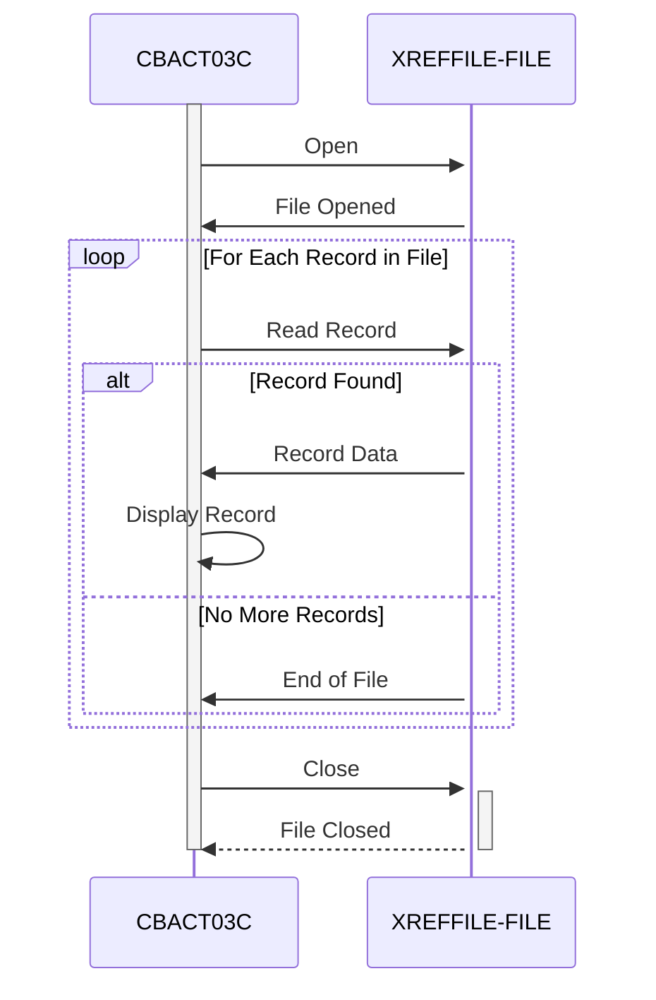

Generated at: 1st October of 2024

# **Title Document:** Card Account Cross-Reference Data File Processor

# **Summary Description:**
The Card Account Cross-Reference Data File Processor is a program that reads and displays the contents of a file containing cross-referenced credit card account information. This process runs in the background without requiring user interaction. 

# **User Stories:**
As a data analyst, I need to ensure that only valid records are used for analysis, so I need a program that can read and validate customer records from a file.

# **Related Epic:**
7 - Batch Processing

# **Functional Requirements:**
* The program must be able to open and read a file containing cross-referenced credit card account information.
* The program must be able to read and process each record in the file sequentially.
* For each record, the program must display the following information:
    * Credit card number
    * Additional cross-reference data
* The program must be able to handle end-of-file conditions gracefully.
* The program must be able to handle file errors, such as an inability to open the file.

# **Non-Functional Requirements:**
* **Performance:** The program should be able to process large files efficiently.
* **Reliability:** The program should be robust and able to handle unexpected errors.
* **Maintainability:** The code should be well-structured, documented, and easy to understand for future maintenance.

# **Acceptance Criteria:**
* The program successfully opens and reads the cross-reference data file.
* The program correctly reads and displays the information for each record in the file.
* The program gracefully handles end-of-file conditions and terminates successfully.
* The program handles file errors appropriately and displays descriptive error messages.

# **Code Improvements:**
* Implement a logging mechanism to record program execution details, errors, and warnings. This will aid in debugging and monitoring.
* Consider adding a feature to write the processed data to an output file, providing flexibility in how the data can be used.
* Refactor the error handling logic to provide more specific error messages based on the file status codes.
* Add comments to the code to explain the purpose of each section and improve readability.

# **Security Improvements:**
* Implement access controls to restrict unauthorized access to the program and the cross-reference data file.
* If the data in the file is sensitive, consider implementing encryption at rest to protect it from unauthorized access.
* Maintain an audit trail of program executions, including the user who ran the program and the time of execution.

# **Conceptual Diagram:**

--Made by "Smart Engineering" (by Compass.UOL)--