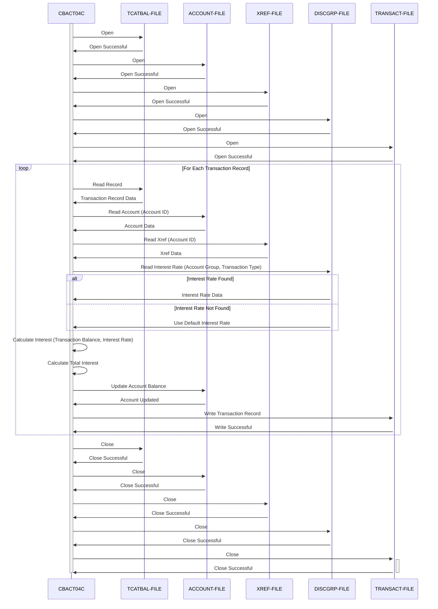

Generated at: 1st October of 2024

**Title Document:** CardDemo Interest Calculation - Batch Processing Program

**Summary Description:** This program calculates and applies monthly interest to customer credit card accounts based on transaction history and predefined interest rates. The calculated interest is then updated to the account balance, and a record of the transaction is generated. 

**User Stories:**
As a financial data analyst, I need to ensure that customer accounts are charged the correct interest each month, so that we can maintain accurate financial records.

**Related Epic:** 7 - Batch Processing

**Functional Requirements:**
1. **Read Transaction Data:** Read and process each customer's transaction details from the Transaction Category Balance File (`TCATBAL-FILE`).
2. **Retrieve Account Information:** For each transaction, fetch the corresponding customer account information from the Account Master File (`ACCOUNT-FILE`) using the Account ID.
3. **Determine Interest Rate:** Identify the applicable interest rate based on the customer's account group and transaction category from the Disclosure Group File (`DISCGRP-FILE`). 
    * **Business Rule:** If a specific disclosure group's interest rate is not found, the system shall use the default interest rate associated with the 'DEFAULT' group code.
4. **Calculate Interest:** Calculate the monthly interest for each transaction category by:
    * **Business Rule:** Divide the product of the transaction category balance and the corresponding annual interest rate by 1200 (representing 12 months).
5. **Update Account Balance:** Update the customer's account balance in the Account Master File (`ACCOUNT-FILE`) by adding the calculated total interest.
6. **Generate Transaction Record:**  Create a transaction record for each interest application, detailing the transaction ID, amount, timestamps, and relevant details. Write this record to the Transaction File (`TRANSACT-FILE`).
7. **Close Files:** Properly close all input and output files (`TCATBAL-FILE`, `ACCOUNT-FILE`, `DISCGRP-FILE`, `TRANSACT-FILE`) to ensure data integrity.

**Non-Functional Requirements:**
* **Performance:** The program should process large volumes of transaction data efficiently within a reasonable timeframe.
* **Reliability:** The program must operate reliably without errors, ensuring accurate interest calculations and updates to account balances.
* **Maintainability:** The program code should be well-structured, documented, and easy to understand for future maintenance and enhancements.
* **Security:** 
    * The program must run in a secure environment with appropriate access controls to prevent unauthorized access to sensitive financial data.
    * All file operations (read, write, update) should be logged for audit purposes.

**Acceptance Criteria:**
* The program successfully reads and processes all customer transaction records from the input file.
* The interest calculation for each transaction is accurate, adhering to the defined business rules.
* Customer account balances in the Account Master File are correctly updated with the calculated interest.
* A transaction record for each interest application is generated and written to the Transaction File.
* The program handles file errors gracefully, logging any issues encountered during processing.
* The program execution completes within an acceptable timeframe.

**Code Improvements:**
* **Error Handling:** Implement a centralized and consistent error handling mechanism to gracefully manage exceptions, log errors, and potentially allow for recovery or notification.
* **Logging:** Enhance logging to capture more detailed information about the program execution, including the number of records processed, interest rates applied, and any errors encountered. This will aid in debugging and monitoring the program's performance.
* **Modularity:**  Break down the program into smaller, more manageable modules or subroutines to improve code readability, maintainability, and potential code reuse.
* **Parameterization:**  Allow for configuration parameters to be passed to the program, such as file paths, interest rates, or other variables, to increase flexibility and reduce the need for code changes.

**Security Improvements:**
* **Access Control:** Ensure that only authorized personnel or systems have access to execute the batch program and access the sensitive data files.
* **Data Encryption:** Consider encrypting sensitive data at rest (in the data files) and in transit (during file processing) to protect against unauthorized access.
* **Audit Trails:**  Implement comprehensive audit trails to track all file accesses, data modifications, and program executions for security and compliance purposes. 

**Conceptual Diagram:**

--Made by "Smart Engineering" (by Compass.UOL)--