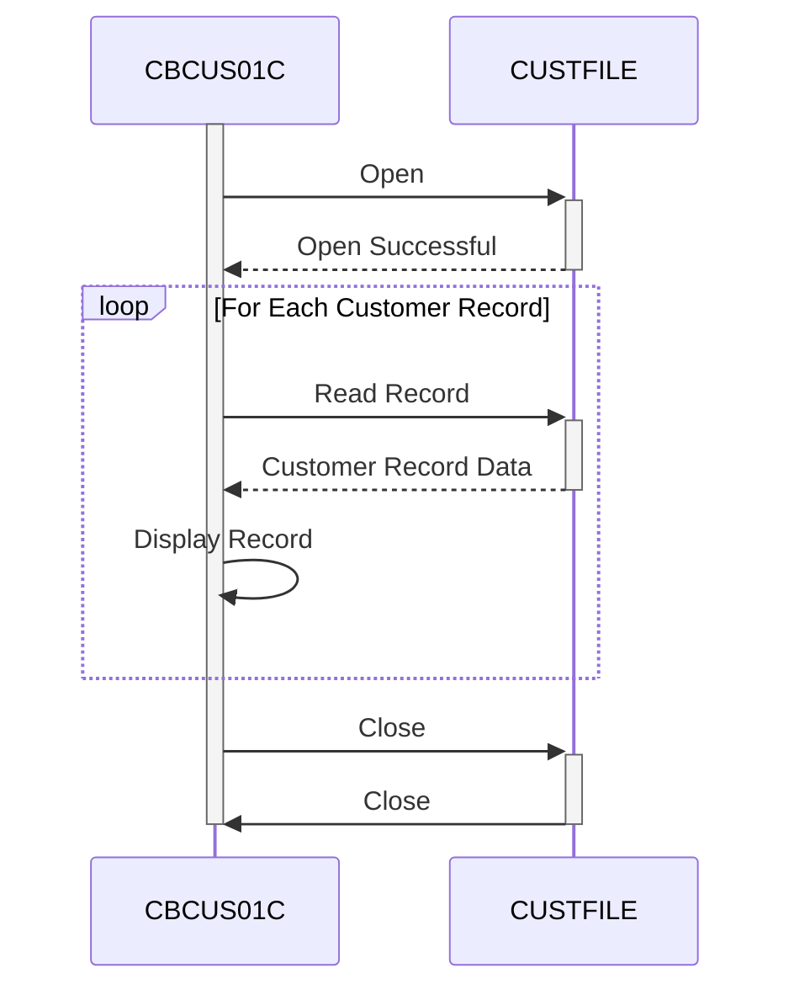

Generated at: 1st October of 2024

# **CardDemo Customer Data Extract**

## **Summary Description:**

This batch program reads customer data from a file named `CUSTFILE` and displays the information on the screen. It's like going through a file cabinet, opening each customer's folder, and then showing the information to the user.

## **User Stories:**

As a data analyst, I need to be able to view customer data so that I can analyze it and generate reports.

## **Related Epic:**

8 - Customer Data Management

## **Functional Requirements:**

1.  **Open Customer Data File:** The program must open the `CUSTFILE` file.
2.  **Read Customer Records:** The program must read customer records sequentially from the `CUSTFILE` file.
3.  **Display Customer Data:** The program must display the contents of each customer record on the screen.
4.  **Handle End of File:** The program must gracefully handle the end of the `CUSTFILE` file.
5.  **Close Customer Data File:** The program must close the `CUSTFILE` file.
6.  **Error Handling:** The program must include error handling for file operations, such as:
    *   File open errors
    *   File read errors
    *   File close errors.

## **Non-Functional Requirements:**

1.  **Performance:** The program should process the customer data efficiently.
2.  **Reliability:** The program should be reliable and handle errors gracefully.
3.  **Maintainability:** The program should be well-documented and easy to understand for future maintenance.
4.  **Security:** Access to the `CUSTFILE` and the display of sensitive customer data should be restricted and audited to maintain data security and privacy.

## **Acceptance Criteria:**

1.  The program successfully opens the `CUSTFILE` file.
2.  The program reads and displays all customer records from the file.
3.  The program handles the end of the file gracefully.
4.  The program closes the `CUSTFILE` file.
5.  The program handles file operation errors and displays appropriate messages.

## **Code Improvements:**

1.  **Improve Error Handling:** Implement more specific error handling for different file operation errors. This could involve checking for specific file status codes and displaying more informative error messages to the user.
2.  **Enhance Documentation:** Add more comments to the code to explain the purpose of different sections and functions. This will make the code easier to understand for future maintenance.
3.  **Consider Logging:** Implement a logging mechanism to record program execution details, including any errors encountered. This can be useful for debugging and monitoring program behavior.

## **Security Improvements:**

1.  **File Permissions:** Ensure that the `CUSTFILE` has appropriate file permissions to restrict unauthorized access.
2.  **Data Encryption:** Consider encrypting the sensitive customer data within the `CUSTFILE` to protect it from unauthorized access.
3.  **Auditing:** Implement an audit trail to track who accesses and modifies the `CUSTFILE`.

## **Conceptual Diagram:**

--Made by "Smart Engineering" (by Compass.UOL)--