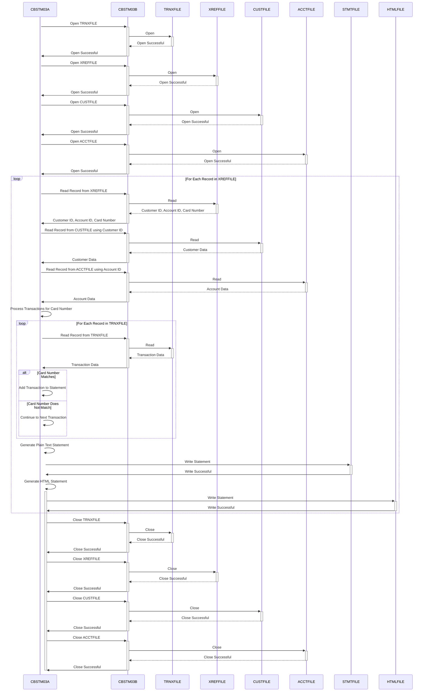

Generated at: 1st October of 2024

# **Title Document:** CardDemo Account Statement Generator - Program Specification

# **Summary Description:**
The CardDemo Account Statement Generator program (CBSTM03A.CBL) is a batch process that generates account statements for credit card holders. The program reads customer, account, and transaction data from various input files, performs calculations, and generates statements in plain text and HTML formats.

# **User Stories:**
As a data analyst, I need to ensure that only valid records are used in financial analysis, so I need a program that can read and validate data from multiple sources and generate accurate account statements.

# **Related Epic:**
4 - Transaction Processing

# **Functional Requirements:**
* The program must read customer data from the `CUSTFILE`.
* The program must read account data from the `ACCTFILE`.
* The program must read transaction data from the `TRNXFILE`.
* The program must validate that transaction data is correctly associated with customer and account data.
* The program must calculate the total expenses for each account based on the transaction data.
* The program must generate account statements in plain text format, adhering to a predefined layout.
* The program must generate account statements in HTML format, suitable for online viewing.
* The program must handle file I/O operations, including opening, reading, writing, and closing files.
* The program must implement error handling mechanisms to gracefully manage issues like invalid data or file errors.

**Business Rules:**
* **Data Integrity:** The program ensures that data from different sources (`CUSTFILE`, `ACCTFILE`, `TRNXFILE`) is accurately matched and presented. For instance, it makes sure that transactions are linked to the correct account and customer.
* **Clarity and Transparency:** The generated statement is designed to be easy to understand, providing a clear overview of all account activity. 
* **Flexibility:** By producing both plain text and HTML versions, the program caters to different preferences and delivery methods.

# **Non-Functional Requirements:**
* **Performance:** The program should process large transaction volumes efficiently within a reasonable timeframe.
* **Reliability:** The program must operate reliably, producing accurate and consistent results.
* **Maintainability:** The program's code should be well-structured, documented, and easy to understand and maintain.
* **Security:** The program should handle sensitive financial data securely, incorporating access controls and data encryption as needed.

# **Acceptance Criteria:**
* The program successfully reads and processes customer, account, and transaction data from the input files.
* The program correctly validates data integrity, ensuring transactions are linked to the correct customers and accounts.
* The program accurately calculates total expenses for each account based on the transaction history.
* The program generates plain text and HTML statements that adhere to the specified layouts.
* The program handles errors gracefully, logging issues and exiting gracefully without data corruption.

# **Code Improvements:**
* **Error Handling:** Enhance error handling by providing more specific error messages and implementing a centralized error logging mechanism.
* **Documentation:** Improve code readability and maintainability by adding more in-line comments explaining complex logic and data structures.
* **Performance Optimization:**  Investigate performance bottlenecks, potentially using sorting or indexing techniques for large datasets.

# **Security Improvements:**
* **File Permissions:**  Implement strict file permissions to restrict access to sensitive data files.
* **Data Encryption:** Consider encrypting sensitive data at rest and in transit to protect customer information.
* **Auditing:** Implement an audit trail to track program execution, data access, and any modifications made to sensitive data.

# **Conceptual Diagram:**

--Made by "Smart Engineering" (by Compass.UOL)--