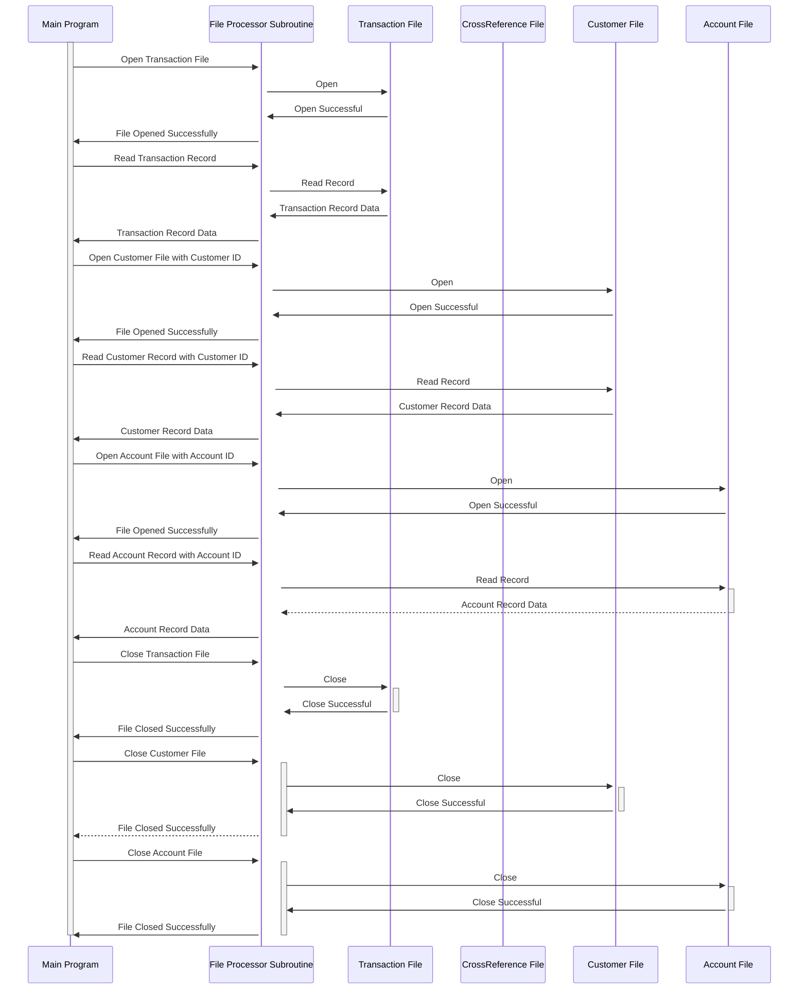

Generated at: 1st October of 2024

# **Title Document:** Card Transaction File Processor Subroutine - Technical Specification

# **Summary Description:**
This subroutine is a critical part of a larger COBOL program that manages credit card transactions. It acts like a data librarian, fetching information from different files upon request. 

Imagine you have separate filing cabinets for:

1. **Transactions:**  Details of each credit card purchase.
2. **Cross-references:** Linking credit cards to their respective accounts.
3. **Customers:**  Personal information about each cardholder.
4. **Accounts:**  Specifics like credit limit and balance for each account.

This subroutine opens the correct cabinet, retrieves the needed information based on provided identifiers (like account number), and delivers it back to the main program. It ensures accurate and efficient data processing for credit card operations.

# **User Stories:**
As a batch processing system, I need to access and process customer, account, and transaction data from separate files to ensure the smooth and accurate operation of credit card management tasks.

# **Related Epic:**
4 - Transaction Processing

# **Functional Requirements:**
* **File Access:** Open, read, and close connections to the Transaction, Cross-Reference, Customer, and Account files.
* **Request Handling:**  Receive and interpret requests from the main program, including:
    * **Target File:** Which file to interact with.
    * **Action:**  Open, read, close, or read with a specific key (e.g., find customer by ID).
    * **Key:** When applicable, the identifier to locate specific records within a file.
* **Data Retrieval:**  Retrieve data from the specified file and record, based on the provided key.
* **Error Handling:**  Detect and report any errors encountered during file operations, such as file not found, invalid key, or permission issues.

**Business Rules:**
* **Sequential Processing (Transaction File):** Transactions are processed one by one in the order they appear in the file.
* **Key-Based Access (Customer and Account Files):**  Records are retrieved using unique identifiers (customer ID, account ID).
* **Error Reporting:**  Standardized error codes are used to communicate issues back to the main program.

# **Non-Functional Requirements:**
* **Performance:** The subroutine should complete file operations quickly and efficiently, minimizing impact on the overall batch processing time.
* **Reliability:**  Guarantee accurate data retrieval and handling, preventing data corruption or loss.
* **Maintainability:**  The code should be well-structured, documented, and easy to understand for future modifications.

# **Acceptance Criteria:**
* The subroutine successfully opens, reads from, and closes all specified data files.
* Data retrieval using provided keys is accurate and consistent.
* Errors during file operations are caught and reported with appropriate error codes.
* The subroutine's performance does not significantly impact the overall batch processing time.

# **Code Improvements:**
* **Centralized Error Handling:**  Create a common error-handling routine to avoid redundant code and ensure consistent error reporting.
* **Detailed Logging:**  Implement logging for all file operations and errors to aid in debugging and system monitoring.
* **Parameter Validation:** Add checks to ensure that input parameters (target file, action, key) are valid before proceeding with file operations.

# **Security Improvements:**
* **File Access Control:** Implement appropriate file permissions to restrict unauthorized access to sensitive data.
* **Data Encryption:**  Consider encrypting sensitive data within the files to protect against unauthorized disclosure.
* **Audit Trail:** Log all file access attempts, including user ID and timestamps, for security auditing purposes.

# **Conceptual Diagram:**

--Made by "Smart Engineering" (by Compass.UOL)--