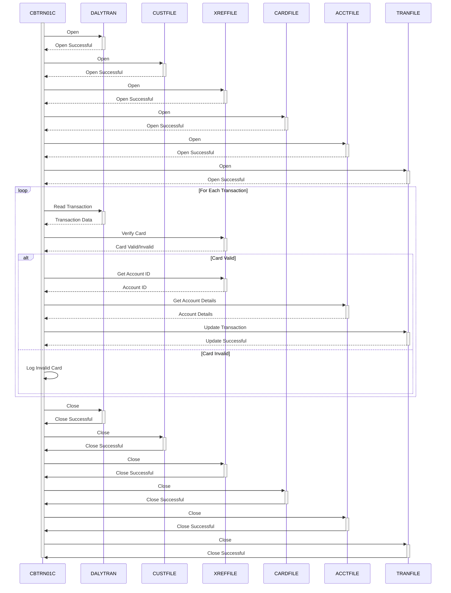

Generated at: 1st October of 2024

# **Title Document:** CardDemo - Daily Transaction Processing - Program Specification

# **Summary Description:**
This program processes daily credit card transactions. It checks if each transaction is valid and updates customer accounts accordingly. It's like a system that automatically makes sure all the day's credit card activity is correct and that customer balances are up to date.

# **User Stories:**
As a data analyst, I need to ensure that all credit card transactions are processed accurately so that I can use this data for analysis and reporting.

# **Related Epic:**
4 - Transaction Processing

# **Functional Requirements:**

1. **File Handling:**
    - The program must open and read records from the daily transaction file (`DALYTRAN`).
    - It should open and read records from the customer file (`CUSTFILE`) based on customer ID.
    - It should open and read records from the card-account cross-reference file (`XREFFILE`) based on card number.
    - It should open and read records from the card file (`CARDFILE`) based on card number.
    - It should open and read records from the account file (`ACCTFILE`) based on account ID.
    - It should open and write records to the transaction file (`TRANFILE`).
    - Finally, the program should close all opened files.

2. **Card Verification:**
    - For each transaction, the program must verify if the card number is valid by checking against the `XREFFILE`.
    - **Business Rule:**  Only transactions made with valid and active cards should be processed.

3. **Account Retrieval:**
    - After successful card verification, the program should retrieve the corresponding account ID from the `XREFFILE`.
    - **Business Rule:**  Every valid card must be linked to an account to ensure transactions are assigned correctly.

4. **Transaction Processing:**
    - The program should prepare to update transaction records based on the processed data.
    - **Business Rule:**  All processed transactions, whether successful or failed, should be logged for auditing and reconciliation purposes.

# **Non-Functional Requirements:**

1. **Performance:** The program should process transactions efficiently, especially considering the high volume of daily transactions.
2. **Reliability:** The program should be robust and capable of handling unexpected errors gracefully without disrupting the processing of other transactions.
3. **Maintainability:** The code should be well-structured, documented, and easy to understand for future maintenance and enhancements.
4. **Security:** Access to the program, data files, and sensitive information should be restricted to authorized personnel only. Card numbers and other sensitive data should be encrypted.

# **Acceptance Criteria:**

- The program should successfully open and read data from all required input files (`DALYTRAN`, `CUSTFILE`, `XREFFILE`, `CARDFILE`, `ACCTFILE`).
- It should accurately verify the validity of card numbers used in transactions.
- The program should retrieve the correct account IDs associated with valid card numbers.
- It should successfully write processed transaction records to the transaction file (`TRANFILE`).
- The program should handle file errors and data validation errors gracefully, logging them appropriately for investigation.
- All transactions should be processed completely without any partial updates or data corruption.

# **Code Improvements:**

- Implement a centralized error handling mechanism to manage different error scenarios gracefully.
- Add detailed logging for better debugging and auditing, including timestamps, error codes, and relevant data.
- Consider using a database management system (DBMS) instead of flat files for improved data integrity, security, and query capabilities.
- Explore performance optimization techniques, such as indexing and query optimization, for faster processing.

# **Security Improvements:**

- Implement access control mechanisms to restrict program execution and data access to authorized users only.
- Encrypt sensitive data, such as card numbers and customer information, both in transit and at rest.
- Implement audit trails to track all data access and modifications for security and compliance.

# **Conceptual Diagram:**

--Made by "Smart Engineering" (by Compass.UOL)--