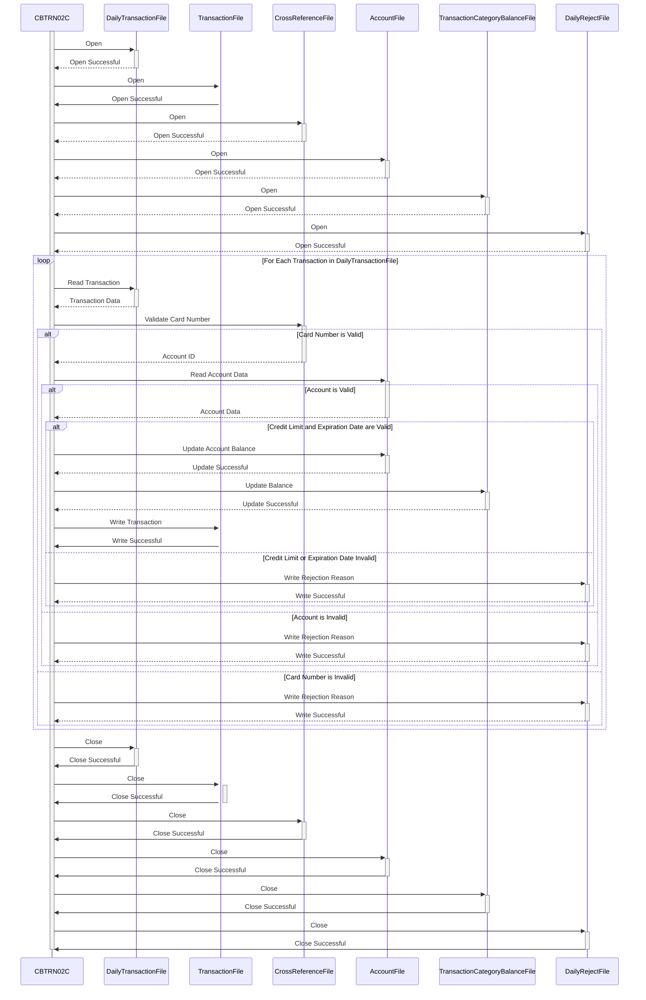

Generated at: 1st October of 2024

# **CardDemo - Daily Transaction Processor Specification**

## **Summary Description:**
The CardDemo Daily Transaction Processor is a batch program that processes daily credit card transactions. It validates each transaction against customer and account information, updates account balances, and categorizes transactions. Rejected transactions are logged for further investigation.

## **User Stories:**
As a data analyst, I need to ensure that only valid credit card transactions are used for analysis and reporting.

## **Related Epic:**
4 - Transaction Processing

## **Functional Requirements:**
- **Read daily transactions:** The program reads a sequential file containing daily credit card transactions.
- **Validate transactions:**
    - **Card Number Validation:** Each credit card number is checked against a cross-reference file to ensure it is valid and associated with an active account.
    - **Account Validation:** The program verifies if a corresponding account exists for the given credit card number.
    - **Credit Limit Check:** The system ensures that a transaction does not exceed the account's available credit limit.
    - **Card Expiration Check:**  Transactions are verified to ensure the credit card used is not past its expiration date.
- **Update account balances:**
    - **Account Balance:** For valid transactions, the customer's account balance is adjusted. Payments increase the balance, while purchases decrease it.
    - **Transaction Category Balance:** The program maintains totals for different transaction categories (e.g., groceries, fuel) for business analysis.
- **Record transactions:** Each processed transaction, along with a timestamp, is recorded in a transaction history file.
- **Handle rejected transactions:** Rejected transactions are written to a separate file with a reason for rejection, creating an audit trail for investigation.

## **Non-Functional Requirements:**
- **Performance:** The program should process a high volume of transactions efficiently within a reasonable time frame.
- **Reliability:** The program should be reliable and ensure data integrity. All valid transactions must be processed accurately, and all rejected transactions must be logged.
- **Maintainability:** The code should be well-documented and structured to facilitate easy maintenance and updates.
- **Error Handling:** The program should include robust error handling to manage unexpected situations gracefully, log errors, and provide informative messages.

## **Acceptance Criteria:**
- The program successfully opens and reads all required input files (daily transactions, cross-reference, accounts).
- All transactions are processed according to the defined business rules.
- Account balances and transaction category balances are updated accurately.
- All processed transactions are correctly written to the transaction history file.
- All rejected transactions, along with the reason for rejection, are logged in the rejects file.
- The program handles errors gracefully, logs error messages, and exits with an appropriate return code.

## **Code Improvements:**
- Implement a more centralized and standardized error handling mechanism to manage different error scenarios consistently.
- Add more detailed logging for better auditing and troubleshooting.
- Explore performance optimization techniques, such as using appropriate data structures or optimizing file I/O, to handle large transaction volumes efficiently.

## **Security Improvements:**
- Implement access controls to restrict unauthorized access to sensitive data files (e.g., account information, credit card numbers).
- Encrypt sensitive data at rest and in transit to protect it from unauthorized access.
- Log all actions performed by the program, including user IDs and timestamps, for auditing purposes.

## **Conceptual Diagram:**

--Made by "Smart Engineering" (by Compass.UOL)--