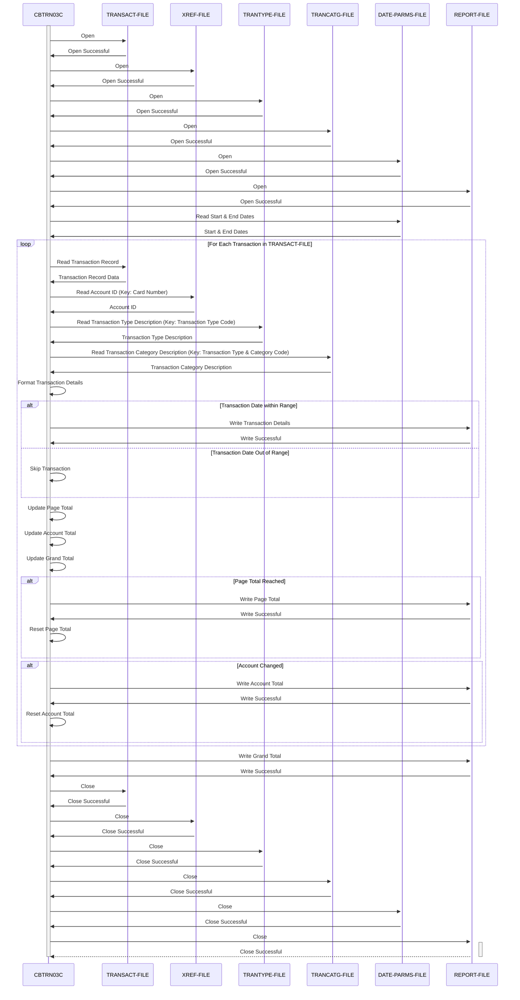

Generated at: 1st October of 2024

**Title Document:** CardDemo Credit Card Transaction Detail Report Program Specification

**Summary Description:** The CardDemo Credit Card Transaction Detail Report program generates a detailed report of credit card transactions for a specified date range. It reads transaction data from a sequential file, retrieves additional information from indexed files based on card numbers and transaction types, and then organizes this information into a formatted report. The report includes individual transaction details, page totals, account totals, and a grand total for all transactions within the specified period.

**User Stories:** As a data analyst, I need a program that can process credit card transaction data and generate a detailed report so that I can analyze transaction patterns, identify trends, and reconcile financial records.

**Related Epic:** 4 - Transaction Processing

**Functional Requirements:**

1.  **Read Transaction Data:** The program must read credit card transaction records from a sequential file (TRANSACT-FILE). Each record contains information such as transaction ID, card number, transaction type code, transaction category code, transaction amount, and transaction processing timestamp. 

2.  **Retrieve Account Information:** For each transaction, the program must retrieve the corresponding account ID from an indexed file (XREF-FILE) using the card number as the key. 

3.  **Retrieve Transaction Type Description:** The program must retrieve the description for each transaction type code from an indexed file (TRANTYPE-FILE) using the transaction type code as the key.

4.  **Retrieve Transaction Category Description:** The program must retrieve the description for each transaction category from an indexed file (TRANCATG-FILE) using a combination of transaction type code and category code as the key.

5.  **Filter Transactions by Date:** The program must filter transactions based on a specified start date and end date, processing only those transactions within that date range.

6.  **Calculate Totals:** The program must calculate and store:
    *   Page totals, accumulating the transaction amounts for each page of the report.
    *   Account totals, accumulating the transaction amounts for each unique account ID encountered.
    *   A grand total, accumulating the transaction amounts for all processed transactions.

7.  **Generate Formatted Report:** The program must write a formatted report to an output file (REPORT-FILE). The report must include:
    *   Report headers with the report title, start date, and end date.
    *   Page headers for each new page.
    *   Transaction details, including transaction ID, account ID, transaction type description, transaction category description, and transaction amount.
    *   Page totals after every set number of transactions.
    *   Account totals whenever there is a change in the account ID being processed.
    *   A grand total at the end of the report.

8.  **Handle File Errors:** The program must handle file-related errors gracefully, displaying appropriate error messages and terminating gracefully in case of issues like:
    *   Inability to open input or output files.
    *   Invalid file statuses encountered during file operations. 

**Non-Functional Requirements:**

1.  **Performance:** The program should process transactions and generate the report in a timely manner, even for large transaction datasets. Consider optimizing file reads and data manipulation operations for improved performance.

2.  **Reliability:** The program should be reliable and produce accurate results consistently. Implement robust error handling and data validation checks to ensure data integrity.

3.  **Maintainability:** The program should be written in a modular and well-documented manner, making it easy to understand, modify, and maintain.

**Acceptance Criteria:**

1.  The program successfully reads transaction data from the TRANSACT-FILE.
2.  The program correctly retrieves account IDs from the XREF-FILE based on card numbers.
3.  The program accurately retrieves transaction type and category descriptions from the respective files.
4.  The program filters transactions accurately according to the specified start and end dates.
5.  The program calculates and displays accurate page totals, account totals, and a grand total.
6.  The generated report is formatted correctly and includes all the required information.
7.  The program handles file-related errors gracefully and provides informative error messages. 

**Code Improvements:**

1.  **Error Handling:** Implement more specific error handling by evaluating different file status codes and displaying more informative messages to the user.
2.  **Modularity:** Break down the program into smaller, more manageable paragraphs for better code organization and readability. For instance, separate the report writing logic into a distinct paragraph.
3.  **Data Validation:** Incorporate data validation checks on the transaction data to ensure its integrity. For instance:
    *   Check if transaction amounts are numeric.
    *   Verify transaction types and categories against valid codes.

**Security Improvements:**

1.  **Access Control:** Implement access control mechanisms to restrict program execution and access to sensitive data files to authorized personnel only.
2.  **Data Encryption:** Encrypt the transaction data files to protect sensitive financial information from unauthorized access. 
3.  **Audit Logging:** Implement audit logging to track program execution, including the user who ran the program, the date and time of execution, and any errors encountered. 

**Conceptual Diagram:**

--Made by "Smart Engineering" (by Compass.UOL)--