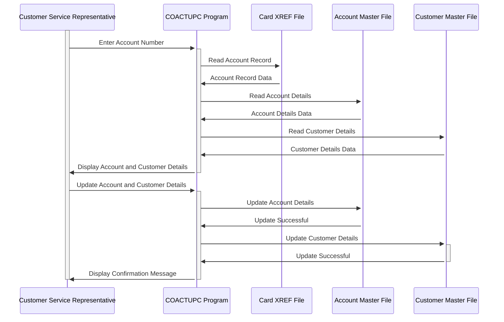

Generated at: 1st October of 2024

**Title Document:** CardDemo Account Update Program Specification

**Summary Description:** The CardDemo Account Update Program is a COBOL program designed to allow authorized users to view and update customer account information. The program retrieves customer data from VSAM files based on the provided account number, displays the information, allows for modifications, and then updates the files with the changed data. It includes data validation to ensure data integrity and concurrency control to prevent data corruption from simultaneous updates.

**User Stories:** As a customer service representative, I need to be able to view and update customer account information accurately and efficiently so that I can provide excellent customer service and support.

**Related Epic:** 2 - Account Management

**Functional Requirements:**

- The program must allow authorized users to view customer account information, including account status, credit limits, balances, open date, expiration date, reissue date, and account group ID.
- The program must allow authorized users to update customer account information.
- The program must retrieve customer information from VSAM files (ACCTDAT, CUSTDAT, CARDDAT, CARDAIX, CXACAIX) based on the provided account number.
- The program must validate user input to ensure data integrity.
  - Account numbers must be numeric, 11 digits long, and non-zero.
  - Account status must be 'Y' or 'N'.
  - Credit limit, cash credit limit, current balance, current cycle credit, and current cycle debit must be valid signed numeric values.
  - Dates (open date, expiration date, reissue date, date of birth) must be in YYYY-MM-DD format and must be valid dates.
  - SSN must be in XXX-XX-XXXX format and must be a valid SSN.
  - FICO score must be between 300 and 850.
  - Names must contain only alphabetic characters and spaces.
  - Address fields must be alphanumeric.
  - Phone numbers must be in (XXX) XXX-XXXX format and must be valid US phone numbers.
  - State code must be a valid US state code.
  - Zip code must be numeric and must be a valid US zip code.
  - The program should perform a cross-field validation to ensure that the entered zip code is valid for the selected state.
- The program must handle concurrent updates to prevent data inconsistencies. Before updating the record, the program checks if the record has been modified by another user since it was last read. If changes are detected, the update is rejected, and the user is informed.
- The program must provide informative messages to the user, including prompts for input, confirmation messages, error messages, and success messages.
- The program must be able to navigate back to the main menu or the calling program.

**Non-Functional Requirements:**

- **Performance:** The program must retrieve and update customer information quickly, even for large datasets. Response times should be minimal to ensure efficient user interaction.
- **Reliability:** The program must be reliable and handle unexpected errors gracefully. Data integrity must be maintained at all times, and the program should not crash or corrupt data.
- **Maintainability:** The program must be well-structured and documented to facilitate maintenance and future enhancements. Code should be modular and easy to understand.
- **Security:** The program must only be accessible to authorized users with appropriate credentials. Sensitive data like customer SSN and financial information should be handled securely.

**Acceptance Criteria:**

- The program correctly retrieves and displays customer account information based on the provided account number.
- The program allows authorized users to modify customer account information and saves the changes correctly.
- The program successfully validates user input according to the defined rules and displays appropriate error messages for invalid input.
- The program handles concurrent updates effectively, preventing data inconsistencies.
- The program provides clear and informative messages to the user throughout the process.
- The program integrates seamlessly with the CardDemo application.

**Settings and Constants:**

| Constant/Parameter | Default Value | Description |
|---|---|---|
| LIT-THISPGM | 'COACTUPC' | Program ID |
| LIT-THISTRANID | 'CAUP' | Transaction ID |
| LIT-THISMAPSET | 'COACTUP ' | Mapset name |
| LIT-THISMAP | 'CACTUPA' | Map name |
| LIT-ACCTFILENAME | 'ACCTDAT ' | Account master file name |
| LIT-CUSTFILENAME | 'CUSTDAT ' | Customer master file name |
| LIT-CARDFILENAME | 'CARDDAT ' | Card data file name |
| LIT-CARDFILENAME-ACCT-PATH | 'CARDAIX ' | Alternate index for CARDDAT based on account ID |
| LIT-CARDXREFNAME-ACCT-PATH | 'CXACAIX ' | Alternate index for a card cross-reference file based on account ID |
| FICO-RANGE-IS-VALID | 300 THROUGH 850 | Valid range for FICO score |

**Code Improvements:**

- **Error Handling:** Implement a more comprehensive error handling mechanism. Instead of simply setting error flags, the program should log detailed error messages, including the specific error condition and relevant data values. This will make troubleshooting and debugging easier.
- **Modularity:**  Break down the program into smaller, more manageable modules or subroutines. This will improve code readability and maintainability. For example, separate the data validation logic into a dedicated subroutine.
- **Data Access:** Optimize data access operations. Consider using indexed access methods for faster retrieval of records. 
- **Comments:** Add more detailed comments to the code to explain the logic and purpose of each section. This will make the code easier to understand for future developers.

**Security Improvements:**

- **Authentication and Authorization:** Implement robust authentication and authorization mechanisms to ensure that only authorized users can access the program and perform updates. Consider using role-based access control to restrict access to specific functionalities based on user roles.
- **Data Encryption:** Encrypt sensitive data like customer SSN and financial information both in storage (VSAM files) and during transmission. This will protect customer privacy and prevent unauthorized access to sensitive data.
- **Audit Trail:** Implement an audit trail to log all user actions, including data viewing, modifications, and attempts to access restricted data. This will provide accountability and help track down unauthorized activities.

**Conceptual Diagram:**

--Made by "Smart Engineering" (by Compass.UOL)--