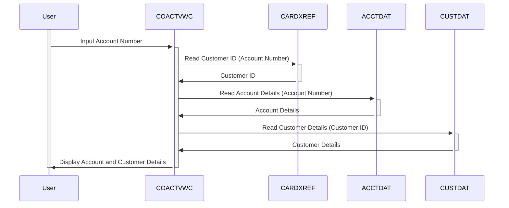

Generated at: 1st October of 2024

# **Title Document:** Credit Card Account View Program Specification

# **Summary Description:**
This program, named "Account View," is a part of a larger Credit Card Management System. Its purpose is to provide a way to view detailed information about a specific credit card account. This is particularly useful for customer service representatives who need to quickly access account details to assist customers. 

# **User Stories:**
As a customer service representative, I need to be able to view comprehensive details of a customer's credit card account so that I can answer their questions accurately and efficiently.

# **Related Epic:** 
2 - Account Management

# **Functional Requirements:**
1. **Account Number Input:** The system should allow the user to enter a credit card account number.
2. **Account Data Retrieval:** The system should retrieve the following information based on the provided account number:
    - **From CARDXREF (Account Cross-Reference File):** Customer ID associated with the account.
    - **From CUSTDAT (Customer Data File):** Customer details like name, address, contact information, etc.
    - **From ACCTDAT (Account Data File):** Account-specific details such as current balance, credit limit, account status, etc.
3. **Data Display:** The system should display the retrieved information in a clear and organized format on the screen.
4. **Input Validation:** The system should validate the entered account number to ensure it is a valid format and exists in the system.
5. **Error Handling:** The system should handle invalid account numbers gracefully and display appropriate error messages to the user.
6. **Navigation:** The system should provide options for the user to navigate to related functionalities, such as viewing transaction history or updating account information.

# **Non-Functional Requirements:**
1. **Performance:** The system should retrieve and display account information with minimal response time.
2. **Usability:** The user interface should be intuitive and easy to use, allowing for efficient data entry and review.
3. **Security:** Access to the "Account View" functionality and sensitive account information should be restricted to authorized personnel only.

# **Acceptance Criteria:**
1. The system successfully retrieves and displays all relevant account information when a valid account number is provided.
2. The system displays appropriate error messages for invalid or non-existent account numbers.
3. The user interface is easy to navigate and provides clear instructions for use.
4. The system meets the defined performance requirements for response time.
5. Access control measures are in place to restrict access to authorized users only.

# **Code Improvements:**
1. **Centralized Error Handling:** Implement a centralized error handling routine to improve code maintainability and consistency in error reporting.
2. **Code Modularity:**  Break down the program into smaller, more manageable modules for improved readability and maintainability.
3. **Meaningful Variable Names:**  Use descriptive variable names to improve code readability and understanding.
4. **Comments and Documentation:** Add clear and concise comments to explain complex logic and document the program's functionality.

# **Security Improvements:**
1. **Authentication and Authorization:** Implement robust authentication mechanisms to verify user identities and authorize access based on roles and privileges.
2. **Data Encryption:** Encrypt sensitive data, such as account numbers and customer information, both in transit and at rest, to protect against unauthorized access.
3. **Audit Logging:**  Implement audit logging to track user actions and system events for security auditing and compliance purposes.

# **Conceptual Diagram:**

--Made by "Smart Engineering" (by Compass.UOL)--