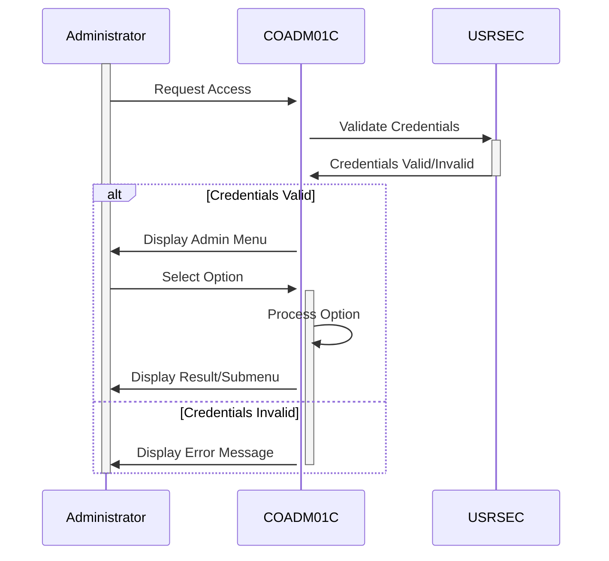

Generated at: 1st October of 2024

# **Title Document:** CardDemo Application - Administrative Menu Specification

# **Summary Description:** 
This document outlines the design and functionality of the Administrative Menu within the CardDemo application, a COBOL-based system for managing credit cards. This menu provides authorized users (administrators) with a central hub to access and perform various administrative tasks related to the application.

# **User Stories:**

As an administrator, I need access to a dedicated menu to manage system functions, so that I can perform tasks like user management and report generation without navigating through the regular user interface.

# **Related Epic:** 6 - User Management and Security

# **Functional Requirements:**

1.  **Menu Display:**
    *   The system shall display a list of administrative options to authorized users upon successful login.
    *   Menu options shall be clearly labeled and logically organized.
    *   The system shall highlight the currently selected option.

2.  **Option Selection:**
    *   The system shall allow administrators to navigate through menu options using designated input methods (e.g., arrow keys, mouse).
    *   The system shall provide visual feedback when an option is selected.

3.  **Option Execution:**
    *   The system shall execute the corresponding administrative function when an option is selected and confirmed by the administrator.
    *   The system shall display an appropriate message if an error occurs during the execution of an administrative function.

4.  **Exit Menu:**
    *   The system shall provide an option for administrators to exit the Administrative Menu and return to the previous screen or the login screen.

# **Non-Functional Requirements:**

1.  **Security:**
    *   Only authorized users with administrative privileges shall be granted access to the Administrative Menu.
    *   The system shall log all actions performed within the Administrative Menu for auditing purposes.

2.  **Usability:**
    *   The Administrative Menu shall be easy to navigate and use, even for administrators with limited technical expertise.
    *   The system shall provide clear and concise instructions or help messages when needed.

3.  **Performance:**
    *   The Administrative Menu should load and respond quickly to user interactions.

# **Acceptance Criteria:**

1.  **Menu Access:**
    *   Administrators can successfully access the Administrative Menu after logging in with valid credentials.
    *   Unauthorized users are denied access to the Administrative Menu.

2.  **Menu Navigation:**
    *   Administrators can navigate through the menu options using the designated input methods.
    *   The system provides visual feedback to indicate the currently selected option.

3.  **Option Execution:**
    *   Selecting and confirming an option successfully executes the corresponding administrative function.
    *   The system handles errors gracefully and displays appropriate messages to the administrator.

4.  **Exit Functionality:**
    *   Administrators can exit the Administrative Menu and return to the previous screen or login screen without encountering any errors.

# **Code Improvements:**

*   Implement a centralized error handling mechanism to manage and log errors consistently.
*   Use a table-driven approach for defining menu options and their associated actions to improve maintainability.
*   Add comments to the code to improve readability and understandability for future developers.

# **Security Improvements:**

*   Implement input validation to prevent vulnerabilities like SQL injection or cross-site scripting (XSS).
*   Encrypt sensitive data stored or transmitted by the application, such as user credentials and card details.
*   Regularly review and update access control lists to ensure only authorized personnel have administrative privileges.

# **Conceptual Diagram:**

--Made by "Smart Engineering" (by Compass.UOL)--