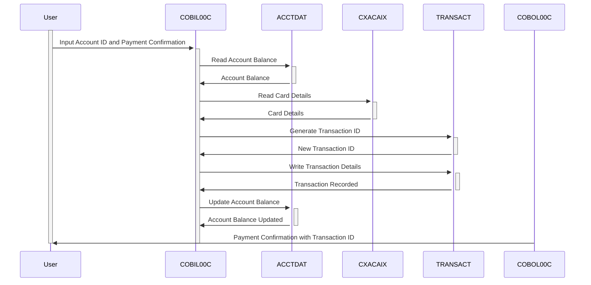

Generated at: 1st October of 2024

# CardDemo - Online Bill Payment Specification

## Summary Description

This document outlines the "Online Bill Payment" functionality within the CardDemo application, enabling credit cardholders to settle their outstanding balance in full through a secure online interface. The process is integrated with the credit card system, ensuring accurate balance updates and transaction logging.

## User Stories

As a CardDemo user, I want to pay my credit card bill online so I can conveniently manage my account without contacting customer support.

## Related Epic

**4 - Transaction Processing:** This story falls under transaction processing, covering various functionalities related to handling credit card transactions securely and efficiently.

## Functional Requirements

1. **Account Balance Retrieval:**
   - The system shall retrieve and display the current balance from the ACCTDAT file upon successful login and account validation.
2. **Full Balance Payment:**
   - The system shall process payments for the full outstanding balance only.
   - Partial payments shall not be allowed through this functionality.
3. **Payment Confirmation:**
   - Before processing, the system shall prompt the user to confirm their payment.
   - The user must explicitly confirm the payment to proceed.
4. **Transaction Processing:**
   - Upon confirmation, the system shall generate a unique Transaction ID.
   - The system shall record the payment details (amount, date, time) in the TRANSACT file.
   - The system shall update the Account balance in the ACCTDAT file to reflect the payment.
5. **Payment Confirmation Display:**
   - The system shall display a confirmation message to the user upon successful payment processing.
   - The confirmation message shall include the generated Transaction ID for future reference.

## Non-Functional Requirements

- **Security:** The online payment process shall be secured using encryption and authentication protocols to protect sensitive data.
- **Performance:** The system should process bill payments efficiently, with minimal response time for balance retrieval, payment confirmation, and transaction logging.
- **Availability:** The online bill payment functionality should be available 24/7 with minimal downtime.
- **Auditability:** All transactions shall be logged with relevant details, including user ID, timestamp, and transaction amount, for auditing and reporting purposes.

## Acceptance Criteria

- The system successfully retrieves and displays the user's current account balance.
- The system only allows full balance payments and rejects any partial payment attempts.
- The system prompts the user to confirm their payment before processing.
- The system generates a unique Transaction ID for each successful payment.
- The system accurately updates the account balance after a successful payment.
- The system logs all transaction details in the TRANSACT file for auditing.
- The system displays a confirmation message with the Transaction ID to the user after successful payment.

## Code Improvements

- **Error Handling:** Implement robust error handling to gracefully manage various scenarios like invalid input, connection issues, or insufficient funds.
- **Logging:** Enhance logging capabilities to capture detailed information during each step of the bill payment process, aiding in debugging and issue resolution.
- **Code Modularity:** Refactor code by breaking down large functions into smaller, manageable modules for better readability and maintainability.

## Security Improvements

- **Data Encryption:** Encrypt sensitive data, including account numbers and payment details, both in transit and at rest, to prevent unauthorized access.
- **Input Validation:** Implement strict input validation to sanitize user inputs and prevent vulnerabilities like SQL injection or cross-site scripting (XSS).
- **Authentication and Authorization:** Enforce strong authentication mechanisms, such as two-factor authentication, and role-based authorization to control access to the bill payment functionality.

## Conceptual Diagram

--Made by "Smart Engineering" (by Compass.UOL)--