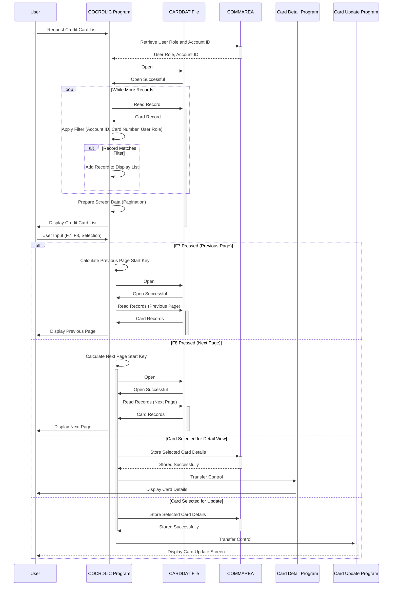

Generated at: 1st October of 2024

# **Title Document:** Credit Card List Display and Navigation

# **Summary Description:**
This module presents a list of credit cards to the user, allowing for navigation and selection. Administrators view all cards, while regular users see cards linked to their account.

# **User Stories:**
As a credit card administrator, I need to be able to view a list of all credit cards in the system so that I can manage them effectively. 

As a regular user, I need to be able to view a list of credit cards associated with my account so that I can review my card details.

# **Related Epic:**
3 - Credit Card Management

# **Functional Requirements:**
- **User Role-Based Access Control:**
    - Administrators can view all credit cards.
    - Regular users can only view cards linked to their own account number, passed to the program via a communication area (`COMMAREA`).
- **Display Credit Card List:**
    - The program retrieves and displays a list of credit cards, adhering to the access control rules.
- **Pagination:**
    - The list is displayed in pages, with a maximum number of records per page (e.g., 7).
    - Users can navigate through the pages using function keys:
        - `F7` - Previous Page
        - `F8` - Next Page
- **Filtering:**
    - Users can optionally filter the list by:
        - Account ID: An 11-digit number.
        - Card Number: A 16-digit number.
- **Selection for Detail View/Update:**
    - Users can select a single card from the list to:
        - View detailed card information (transferred to a dedicated card detail program).
        - Update card information (transferred to a dedicated card update program).

# **Non-Functional Requirements:**
- **Performance:** The program should retrieve and display the credit card list with minimal response time, even for large datasets.
- **Usability:**
    - The screen layout should be clear, concise, and easy to understand.
    - Navigation and filtering options should be intuitive.
- **Reliability:** The program should function reliably, handling errors gracefully and preventing data corruption.
- **Maintainability:** The code should be modular, well-documented, and easy to understand for future maintenance and enhancements.

# **Acceptance Criteria:**
- The program correctly displays a paginated list of credit cards based on the user's role and applied filters.
- Users can successfully navigate through the pages using `F7` and `F8` keys.
- Filtering by Account ID and/or Card Number functions accurately.
- Selecting a card correctly transfers the card details to the appropriate program for detail view or update.
- The program handles errors gracefully, displaying informative messages to the user.
- The program meets performance expectations, displaying the list quickly even with a large number of credit card records.

# **Settings and Constants:**
| Constant/Parameter | Default Value | Description |
|---|---|---|
| `WS-MAX-SCREEN-LINES` | 7 | Maximum number of credit card records displayed per page. |
| `LIT-CARD-FILE` | `'CARDDAT '` | Name of the VSAM file storing credit card data. |
| `LIT-CARD-FILE-ACCT-PATH` | `'CARDAIX '` | Name of the alternate index on the `CARDDAT` file, likely used for efficient retrieval by Account ID. |

# **Code Improvements:**
- **Error Handling:**
    - Implement a more centralized error handling mechanism to streamline error reporting and recovery.
    - Provide more specific error messages to the user, indicating the nature of the error and potential solutions.
- **Code Structure:**
    - Refactor repetitive code blocks into reusable subroutines to improve code readability and maintainability. For example, the screen array initialization and attribute setup sections can be simplified.
- **Documentation:**
    - Add comprehensive comments to explain the program's logic, data structures, and functions.
    - Create external documentation that outlines the program's specifications, usage instructions, and technical details.
- **Performance:**
    - Investigate using a more efficient sorting algorithm for the credit card list if performance becomes an issue with very large datasets.

# **Security Improvements:**
- **Data Encryption:**
    - Encrypt sensitive credit card information stored in the `CARDDAT` file to protect against unauthorized access in case of data breaches.
- **Audit Logging:**
    - Implement audit logging to track user actions, such as viewing, updating, and deleting credit card records, for security and compliance purposes.
- **Input Validation:**
    - Strengthen input validation for the Account ID and Card Number filters to prevent potential injection attacks.
- **Secure Communication:**
    - If the program communicates with other systems or databases, ensure that the communication channels are secure and encrypted.

# **Conceptual Diagram:**

--Made by "Smart Engineering" (by Compass.UOL)--