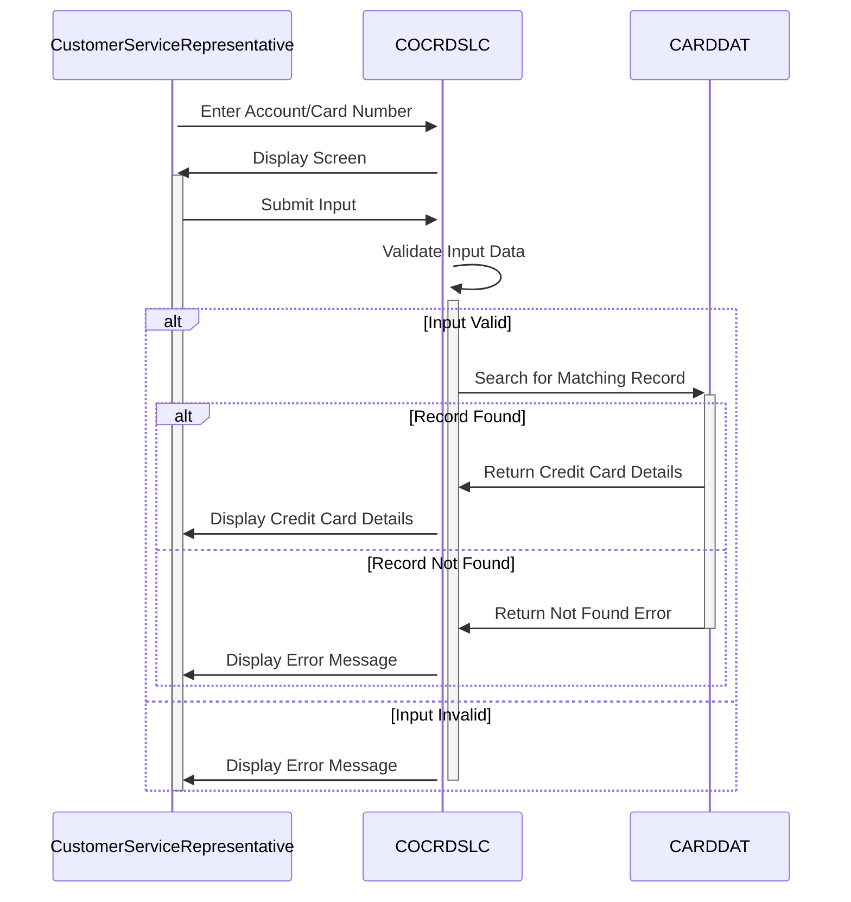

Generated at: 1st October of 2024

# **Title Document:** Credit Card Detail Retrieval Program - Functional Specification

# **Summary Description:**

This program allows customer service representatives to access detailed credit card information by entering either the account number or the card number. The program prioritizes data security by validating user inputs before accessing sensitive data.

# **User Stories:**

As a customer service representative, I need to be able to quickly retrieve a customer's credit card details using either their account number or card number so I can assist them with their inquiries.

# **Related Epic:** 
3 - Credit Card Management

# **Functional Requirements:**

1.  **Input Capture and Validation:**
    *   The system shall allow the user to enter either an 11-digit account number or a 16-digit card number.
    *   The system shall validate that the entered account number or card number is numeric.
    *   The system shall display an error message if the entered data is not numeric or is not the correct length.

2.  **Database Search and Retrieval:**
    *   The system shall search the CARDDAT database for a matching record using the entered account number or card number.
    *   If a matching record is found, the system shall retrieve the following credit card details:
        *   Cardholder's name
        *   Card number
        *   Expiry date
        *   Status

3.  **Data Display:**
    *   The system shall display the retrieved credit card details to the user in a clear and readable format.

# **Non-Functional Requirements:**

1.  **Performance:**
    *   The system shall retrieve and display credit card details within 3 seconds of the user submitting the request.

2.  **Security:**
    *   The system shall only allow authorized users to access credit card details.
    *   The system shall not display any credit card details if the entered information is invalid.

3.  **Availability:**
    *   The system shall be available 24/7.

4.  **Maintainability:**
    *   The system shall be designed in a modular fashion to allow for easy maintenance and updates.

# **Acceptance Criteria:**

1.  The system successfully retrieves and displays credit card details when a valid account number or card number is entered.
2.  The system displays an appropriate error message when invalid or incomplete information is entered.
3.  The system meets the performance, security, and availability requirements outlined in the non-functional requirements section.

# **Code Improvements:**
*   **Standardized Error Handling:** Implement a consistent and user-friendly approach to handling errors, including displaying descriptive error messages to the user.
*   **Code Optimization:**  Explore opportunities to optimize the code for improved performance, especially when handling database interactions.
*   **Documentation:** Add clear and concise comments to the code to improve its readability and maintainability.
*   **Parameterization:** Consider moving file names and other constants to a configuration file for easier maintenance and environment-specific settings.

# **Security Improvements:**
*   **Authentication and Authorization:**  Implement robust authentication mechanisms to verify user identities and authorize access to sensitive credit card information.
*   **Input Sanitization:**  Sanitize all user inputs to prevent vulnerabilities like SQL injection.
*   **Logging and Auditing:**  Log all data access attempts, including user details, timestamps, and actions performed, for security auditing and monitoring purposes.
*   **Data Encryption:**  Encrypt sensitive credit card data both in transit and at rest to protect it from unauthorized access.

# **Conceptual Diagram:**

--Made by "Smart Engineering" (by Compass.UOL)--