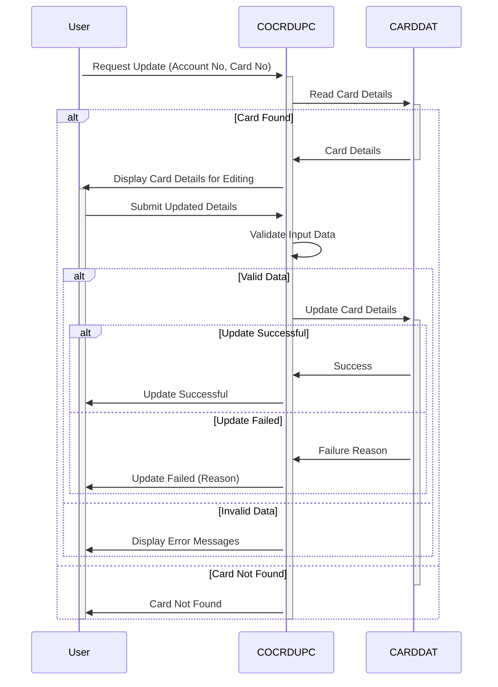

Generated at: 1st October of 2024

# Credit Card Detail Update Program Specification

## Summary Description

This document details the program used for online credit card information update. It receives a request, validates the information, and updates the credit card details in the database, ensuring data integrity and security.

## User Stories

As a credit analyst, I need to be able to view and update customer credit card details so that I can manage their accounts effectively.

## Related Epic

**3 - Credit Card Management**

## Functional Requirements

1. **Request Reception:**
   - The program receives a request to view or update credit card details. This request includes the account number and card number.
2. **Data Retrieval:**
   - The program retrieves the existing credit card information from the database based on the provided account and card numbers.
3. **Input Validation:**
   - The program validates the user's input to ensure data accuracy.
     - Account Number: Must be numeric and 11 digits long.
     - Card Number: Must be numeric and 16 digits long.
     - Cardholder's Name: Can only contain letters and spaces.
     - Expiry Date: Must be a valid date in the future.
     - Card Status: Must be either 'Y' (active) or 'N' (inactive).
4. **Update Processing:**
   - If the input data is valid, the program updates the corresponding record in the database.
   - The program implements locking mechanisms to prevent data corruption from simultaneous updates.
5. **Confirmation and Feedback:**
   - The program provides feedback to the user, confirming the update's success or if any errors occurred.

## Non-Functional Requirements

- **Security:** The program must integrate with existing security modules to ensure only authorized personnel can access and modify sensitive data.
- **Performance:** The program should handle updates efficiently, minimizing response time for the user.
- **Auditability:** The program must log all update actions, including user, timestamp, and changes made, for auditing and tracking purposes.

## Acceptance Criteria

- The program successfully retrieves and displays existing credit card details based on valid account and card numbers.
- The program successfully updates credit card details in the database after successful input validation.
- The program displays appropriate error messages for invalid input data or unsuccessful update operations.
- The program prevents concurrent updates to the same credit card record.
- All update actions are logged in a secure audit trail.

## Code Improvements

- Implement centralized error handling for better maintainability.
- Add detailed comments to the code to improve readability.
- Optimize database queries for improved performance.

## Security Improvements

- Integrate with existing authentication and authorization mechanisms to verify user permissions.
- Encrypt sensitive credit card information both in transit and at rest.
- Implement data masking techniques to protect sensitive data from unauthorized access.

## Conceptual Diagram:

--Made by "Smart Engineering" (by Compass.UOL)--