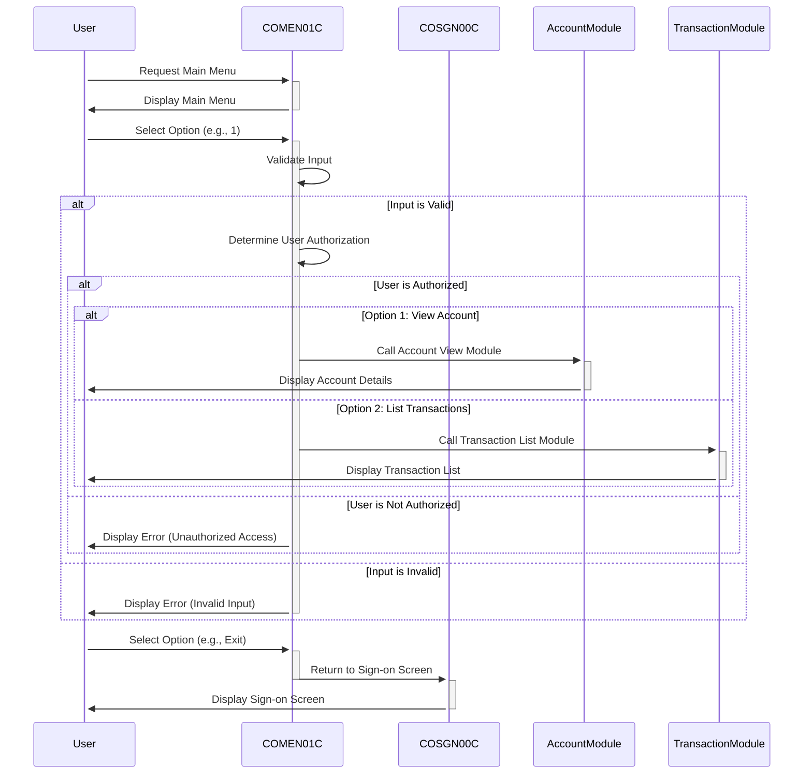

Generated at: 1st October of 2024

# **Title Document:** CardDemo Application - Main Menu Program Specification

# **Summary Description:**
The CardDemo Main Menu program, COMEN01C.cbl, serves as the central navigation point for regular users within the CardDemo application. It presents a menu of options tailored to the user's role, captures their choice, validates the input, and directs them to the appropriate module for execution. This ensures secure access to authorized functionalities and provides a user-friendly interface for interacting with the system.

# **User Stories:**
As a regular user of the CardDemo application, I need a clear and easy-to-use menu system so that I can access and perform various actions related to my account, such as viewing my account details, listing transactions, or making a payment.

# **Related Epic:**
6 - User Management and Security:  This epic focuses on managing user access, roles, and permissions to ensure system security and data confidentiality.

# **Functional Requirements:**
* The program shall display a menu of numbered options to the user.
* The program shall prompt the user to enter the number corresponding to their desired action.
* The program shall validate the user's input to ensure it is a valid number within the range of available options.
* The program shall check if the user is authorized to perform the selected action based on their user type.
* The program shall redirect the user to the appropriate program module based on their selected option.
* The program shall display an error message if the user enters invalid input and prompt them to re-enter.
* The program shall allow the user to exit the menu and return to the sign-on screen.

# **Non-Functional Requirements:**
* The program shall respond to user input within 2 seconds.
* The program shall be available for use 99.9% of the time.
* The program shall be designed in a modular and maintainable manner.
* The program shall follow coding standards and conventions.

# **Acceptance Criteria:**
* The main menu shall be displayed successfully after user login.
* All valid menu options shall be displayed correctly.
* The program shall correctly validate user input and display appropriate messages.
* The program shall successfully redirect the user to the selected module upon valid input.
* The program shall handle invalid input gracefully and prompt for re-entry.
* The program shall allow the user to return to the sign-on screen.

# **Code Improvements:**
* Implement centralized error handling for improved maintainability.
* Add logging capabilities to track user actions and system events.
* Use descriptive variable names to enhance readability.
* Break down large paragraphs into smaller, more manageable procedures.

# **Security Improvements:**
* Implement input sanitization to prevent injection attacks.
* Mask sensitive information, such as passwords, on screen.
* Enforce strong password policies.
* Review and update access control lists regularly.

# **Conceptual Diagram:**

--Made by "Smart Engineering" (by Compass.UOL)--