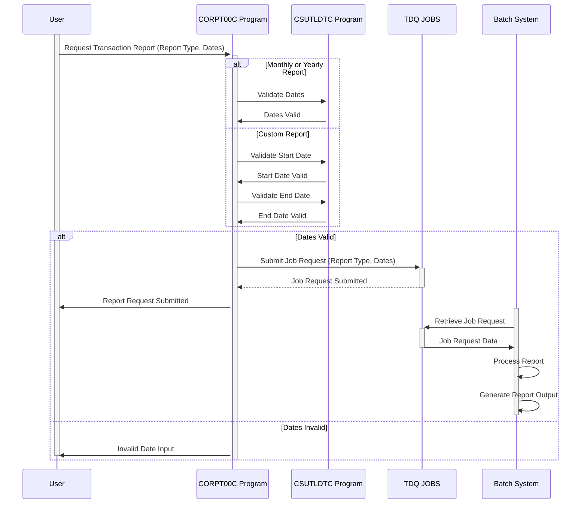

Generated at: 1st October of 2024

# **Title Document:** CardDemo Transaction Report Submission - Program Specification

# **Summary Description:**

This specification document details the functionality of the `CORPT00C.cbl` program within the CardDemo application. This program allows users to initiate the generation of transaction reports based on predefined periods (monthly, yearly) or a custom date range. The program validates user input, prepares a batch job request, and submits it for processing.

# **User Stories:**

As a business user, I need to generate summarized reports of credit card transactions for various periods (monthly, yearly, or custom date range) to analyze business trends and performance.

# **Related Epic:**

**5 - Reporting and Analytics**

# **Functional Requirements:**

1. **Report Type Selection:**
   - The program shall allow the user to choose from three report types:
     - Monthly
     - Yearly
     - Custom

2. **Date Input (Custom Report):**
   - For the "Custom" report type, the program shall prompt the user to enter a start date and an end date.

3. **Date Validation:**
   - The program shall validate the entered dates for:
     - **Format:** Dates must be in the format YYYY-MM-DD.
     - **Logical Order:** The start date cannot be later than the end date.
     - **Valid Dates:** The entered dates must represent valid calendar dates.

4. **Report Request Generation:**
   - Based on the selected report type and entered dates, the program shall generate a batch job request containing:
     - Report type
     - Start date
     - End date

5. **Job Submission:**
   - The program shall submit the generated batch job request to a queue for processing by the batch processing system.

6. **User Feedback:**
   - The program shall provide the user with feedback on the status of their report request:
     - Confirmation message upon successful submission
     - Error message in case of invalid input or other issues

# **Non-Functional Requirements:**

1. **Performance:** The program should process user input and submit the report request with minimal latency, ideally within 2 seconds.
2. **Reliability:** The program should be robust and handle unexpected errors gracefully without crashing. It should ensure data integrity and prevent the generation of incorrect reports.
3. **Maintainability:** The program code should be well-documented and follow a modular structure to facilitate future modifications and enhancements.
4. **Security:** The program should only be accessible to authorized users with the necessary permissions to generate transaction reports.

# **Acceptance Criteria:**

1. The program successfully compiles and links without any errors or warnings.
2. The program correctly displays the report type selection screen and handles user input.
3. The program successfully validates the entered dates and provides appropriate error messages for invalid input.
4. The program generates a well-formatted batch job request containing the correct report type, start date, and end date.
5. The program submits the job request to the designated queue without errors.
6. The program provides the user with appropriate feedback messages (confirmation or error) based on the outcome of the request submission.
7. The program handles unexpected errors gracefully and displays informative error messages to the user.

# **Code Improvements:**

1. **Error Handling:** Implement a centralized error handling routine to capture and log errors consistently. Display detailed error messages to the user, including the error code and a brief description.
2. **Modularity:** Break down the `PROCESS-ENTER-KEY` paragraph into smaller, more manageable subroutines based on the report type. This will improve code readability and maintainability.
3. **Date Validation Library:** Consider using a dedicated date validation library or utility instead of inline validation logic. This will improve code reusability and potentially simplify the validation process.
4. **Configuration:** Externalize configurable parameters, such as the TDQ name (`JOBS`) and the batch program name (`TRANREPT`), to a separate configuration file or environment variables. This will improve flexibility and ease of deployment.

# **Security Improvements:**

1. **Input Sanitization:** Implement proper input sanitization to prevent vulnerabilities like SQL injection or command injection, even though the current implementation suggests a batch-oriented system.
2. **Authentication and Authorization:** Enforce strict authentication and authorization mechanisms to ensure that only authorized users can access and initiate the report generation process.
3. **Auditing:** Log all report generation requests, including the user ID, timestamp, report type, and date range, for auditing and tracking purposes.

# **Conceptual Diagram:**

--Made by "Smart Engineering" (by Compass.UOL)--