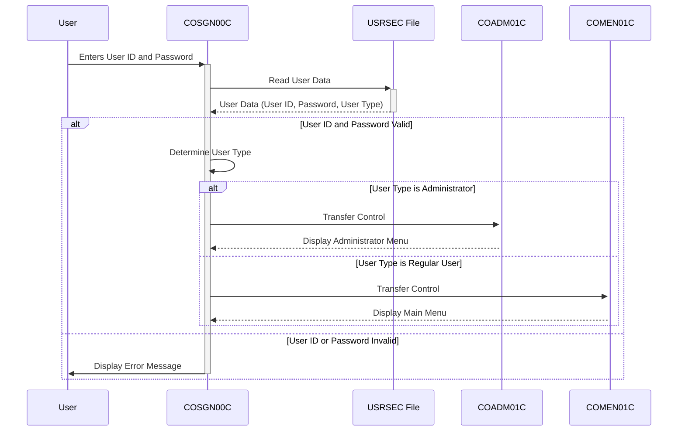

Generated at: 1st October of 2024

# **Title Document:** CardDemo Application - Sign-on Module Specification

# **Summary Description:**
This document outlines the specifications for the Sign-on module (COSGN00C) within the CardDemo application, a COBOL-based system designed for credit card management. The module ensures secure user authentication, validating user credentials against stored data. Upon successful verification, it grants users access to the application based on their defined roles, directing them to the appropriate functionalities.

# **User Stories:**
As a Security Administrator, I want to ensure that only authorized personnel can access the CardDemo application, view sensitive customer information, and perform transactions, to maintain data security and prevent unauthorized access. 

# **Related Epic:**
6 - User Management and Security

# **Functional Requirements:**
1. **Display Sign-on Screen:** The system shall display a sign-on screen to the user, prompting them to enter their User ID and Password. 
2. **Capture User Input:** The system shall capture the entered User ID and Password from the user.
3. **Validate User Credentials:** The system shall validate the entered User ID and Password against the data stored in the user security file (USRSEC). 
    * If the User ID does not exist, an error message "User not found. Try again ..." shall be displayed. 
    * If the User ID exists, but the entered Password does not match the stored Password, an error message "Wrong Password. Try again ..." shall be displayed.
4. **Determine User Type:** Upon successful validation of the User ID and Password, the system shall determine the user's type (e.g., Administrator or Regular User) based on the information stored in the user security file (USRSEC). 
5. **Direct User to Appropriate Menu:** Based on the user's type, the system shall redirect the user to the relevant part of the application: 
    * If the user is an Administrator, the system shall transfer control to the Administrator menu (Program COADM01C).
    * If the user is a Regular User, the system shall transfer control to the Main menu (Program COMEN01C).

# **Non-Functional Requirements:**
1. **Security:** The sign-on process shall be secure, ensuring that only authorized users with valid credentials can access the application. Passwords shall be stored securely to prevent unauthorized access.
2. **Performance:** The sign-on process shall be completed within a reasonable time frame, providing users with quick access to the application.
3. **Usability:** The sign-on screen shall be user-friendly and easy to understand, allowing users to input their credentials easily.
4. **Reliability:** The sign-on module shall be reliable, consistently authenticating valid users and rejecting invalid login attempts. 
5. **Availability:** The sign-on module shall be available during the operational hours of the CardDemo application to ensure uninterrupted access for authorized users.

# **Acceptance Criteria:**
1. **Successful Authentication:** Users with valid credentials (correct User ID and Password) shall be successfully authenticated and granted access to the application.
2. **Unsuccessful Authentication:** Users with invalid credentials (incorrect User ID or Password) or unauthorized users shall be denied access, and appropriate error messages shall be displayed.
3. **Role-Based Redirection:** After successful authentication, users shall be redirected to the correct menu based on their user type (Administrator or Regular User).
4. **Password Security:** Passwords shall be stored securely using appropriate encryption or hashing mechanisms.
5. **Error Handling:** The system shall handle different error scenarios appropriately, such as invalid input, incorrect credentials, and system errors, and display informative error messages to the user.
6. **Performance:** The sign-on process shall be completed within an acceptable time frame, ensuring a smooth user experience.

# **Code Improvements:**
1. **Password Complexity Enforcement:** Implement password complexity rules requiring users to set passwords with a minimum length, a mix of uppercase and lowercase letters, numbers, and special characters.
2. **Password Encryption:** Utilize a strong encryption algorithm to encrypt passwords stored in the USRSEC file, enhancing security.
3. **Error Message Specificity:** Provide more specific error messages to the user, differentiating between an invalid User ID and an incorrect password. 
4. **Unsuccessful Login Attempts:** Implement a mechanism to track unsuccessful login attempts. After a predefined number of unsuccessful attempts, the system should temporarily lock the user account to prevent brute-force attacks.
5. **Logging:** Implement detailed logging of all sign-on attempts, including the User ID used, timestamp, and whether the attempt was successful or not. This information can be valuable for security auditing and troubleshooting.

# **Security Improvements:**
1. **Multi-Factor Authentication (MFA):** Implement MFA to add an extra layer of security to the sign-on process.
2. **Password Expiration Policy:** Implement a password expiration policy to enforce regular password changes.
3. **Secure Session Management:** After successful sign-on, generate a unique session ID and use secure cookies to manage user sessions, preventing session hijacking.
4. **Input Validation:** Strengthen input validation to prevent SQL injection and cross-site scripting (XSS) vulnerabilities.
5. **Regular Security Testing:** Conduct regular security assessments and penetration testing to identify and address potential vulnerabilities.

# **Conceptual Diagram:**

--Made by "Smart Engineering" (by Compass.UOL)--