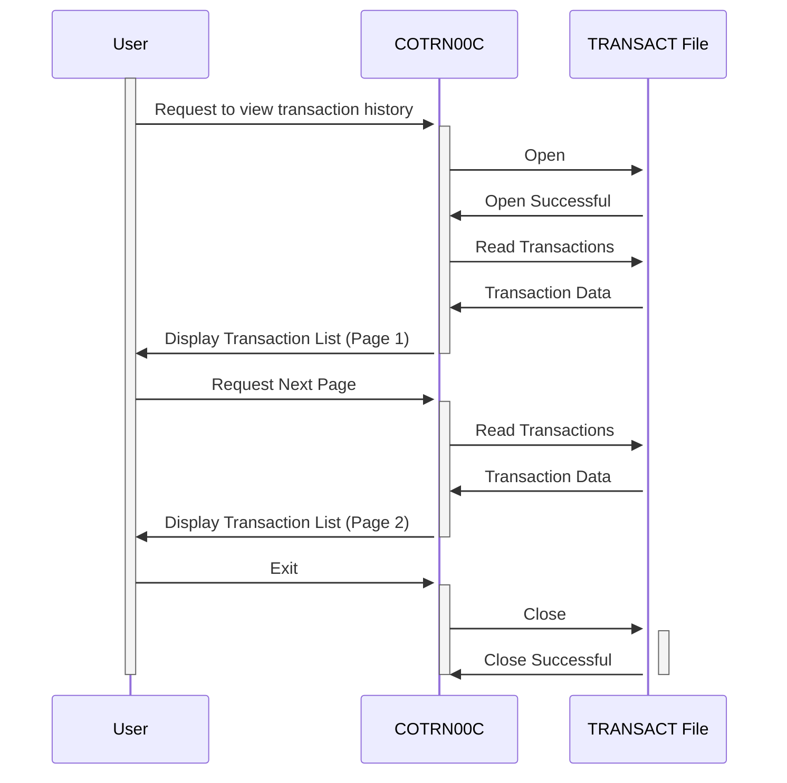

Generated at: 1st October of 2024

# **Title Document:** CardDemo Transaction Listing Module - Business Specification

# **Summary Description:**

The CardDemo Transaction Listing module enables users to review their credit card transaction history. It's similar to viewing a digital bank statement. Users can navigate through pages of past transactions, with each transaction displaying key information such as the date, description, and amount.

# **User Stories:**

As a CardDemo user, I want to be able to view a history of my credit card transactions so that I can track my spending and ensure the accuracy of my statements.

# **Related Epic:**

4 - Transaction Processing

# **Functional Requirements:**

* **Transaction Retrieval:** The system should retrieve and display transactions associated with the logged-in user's account.
* **Pagination:** Transactions should be presented in manageable pages to prevent information overload.
* **Navigation:** Users should be able to move forward and backward through pages of transactions.
* **Transaction Selection:** Users should have the option to select a specific transaction to view more detailed information (not fully implemented in the current version).
* **Error Handling:** The system should display clear messages in case of errors, such as reaching the end of the transaction history or attempting to navigate beyond the first or last page.

# **Non-Functional Requirements:**

* **Performance:** The transaction listing should load quickly and efficiently, even for users with a large transaction history.
* **Usability:** The interface for viewing transactions should be intuitive and easy to navigate.
* **Security:** Access to transaction data should be restricted to authorized users only.

# **Acceptance Criteria:**

* The system successfully retrieves and displays transactions associated with the logged-in user.
* Transactions are displayed in a paginated format, with a user-defined number of transactions per page (currently hardcoded).
* Users can navigate forward and backward through pages of transactions without encountering errors.
* The system displays appropriate messages when the user reaches the beginning or end of the transaction history.
* The system handles errors gracefully and displays informative messages to the user.

# **Code Improvements:**

* Implement user-configurable pagination, allowing users to choose how many transactions to display per page.
* Complete the transaction selection functionality, enabling users to view detailed information for a specific transaction.
* Consider adding search or filtering options to help users find specific transactions.

# **Security Improvements:**

* Implement more robust authentication measures, such as two-factor authentication, to prevent unauthorized access.
* Encrypt sensitive transaction data both in transit and at rest to protect user privacy.
* Implement audit trails to track user access to transaction data for security and compliance purposes.

# **Conceptual Diagram:**

--Made by "Smart Engineering" (by Compass.UOL)--