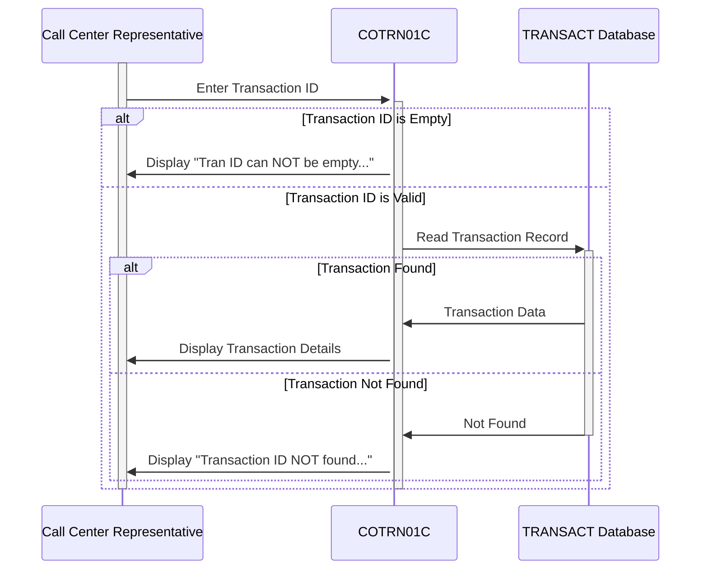

Generated at: 1st October of 2024

# CardDemo Transaction Details Retrieval - Program Specification

## Summary Description:
This program, part of the CardDemo application, allows call center representatives to view details of a specific credit card transaction using its unique ID. This aids customer service and transaction verification.

## User Stories:
As a call center representative, I need to be able to quickly access and view the details of a specific transaction so I can answer customer inquiries accurately and efficiently.

## Related Epic:
4 - Transaction Processing

## Functional Requirements:
1. **Transaction ID Input:**
    - The system shall allow the user to enter a transaction ID.
    - The system shall validate if the input field is not empty.
2. **Transaction Data Retrieval:**
    - The system shall retrieve the transaction record from the 'TRANSACT' database that matches the entered transaction ID.
3. **Transaction Details Display:**
    - If a matching transaction is found, the system shall display the following details:
        - Transaction ID
        - Credit card number
        - Transaction type
        - Transaction category
        - Transaction source
        - Transaction amount
        - Transaction description
        - Transaction origin timestamp
        - Transaction processing timestamp
        - Merchant ID
        - Merchant name
        - Merchant city
        - Merchant zip code
4. **Error Handling:**
    - If the entered transaction ID is empty, the system shall display an error message "Tran ID can NOT be empty...".
    - If no matching transaction is found, the system shall display an error message "Transaction ID NOT found...".
    - If an error occurs during database access, the system shall display an error message "Unable to lookup Transaction...".
5. **Navigation:**
    - The system shall allow the user to navigate back to the previous screen.
    - The system shall allow the user to clear the input field.

## Non-Functional Requirements:
1. **Performance:**
    - The system shall retrieve and display transaction details within 3 seconds.
2. **Security:**
    - Only authorized users shall be able to access the system.
    - The system shall only retrieve and display data from the 'TRANSACT' database.
3. **Usability:**
    - The system shall be easy to use and navigate.
    - The system shall display error messages in a clear and concise manner.

## Acceptance Criteria:
1. The system shall successfully retrieve and display transaction details for a valid transaction ID.
2. The system shall display appropriate error messages for invalid inputs or system errors.
3. The system shall be accessible only to authorized users.
4. The system shall meet the defined performance and usability requirements.

## Code Improvements:
1. **Centralized Error Handling:** Implement a centralized error handling routine to manage different error scenarios gracefully and provide consistent error messages.
2. **Code Modularity:** Refactor the code into smaller, reusable modules/functions to improve code readability and maintainability.
3. **Data Validation:** Implement data validation checks for the entered transaction ID to prevent common data entry errors.

## Security Improvements:
1. **Input Sanitization:** Sanitize user inputs to prevent injection-based vulnerabilities.
2. **Authentication & Authorization:**  Implement robust authentication and authorization mechanisms to control access to the system and its data.
3. **Logging:** Implement audit logging to track user actions and system events for security auditing and troubleshooting.

## Conceptual Diagram:

--Made by "Smart Engineering" (by Compass.UOL)--