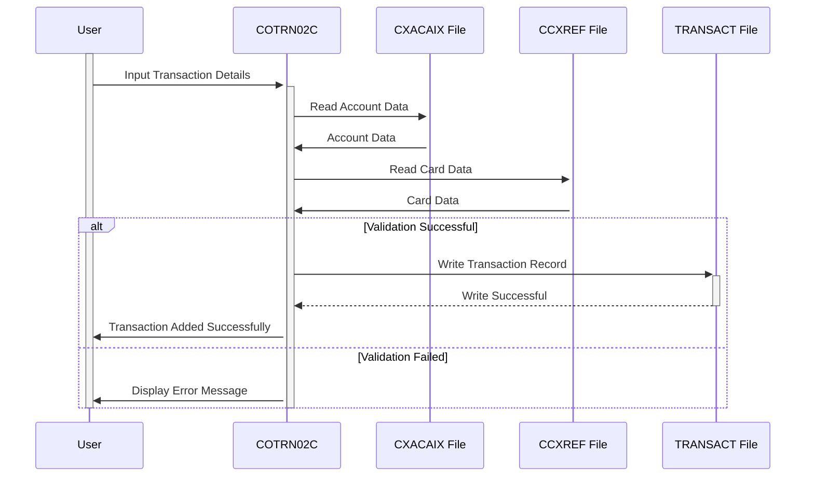

Generated at: 1st October of 2024

**Title Document:** CardDemo Transaction Addition Program Specification

**Summary Description:** This document details the "Add Transaction" functionality within the CardDemo application, enabling authorized users to input new credit card transaction details into the system. This process involves validating user input against predefined rules and recording the transaction upon successful validation.

**User Stories:** As a data analyst, I need to ensure that all transaction records used for analysis are accurate and complete to maintain data integrity and generate reliable insights.

**Related Epic:**  4 - Transaction Processing

**Functional Requirements:**
- The system should allow authorized users to input new transaction details, including account ID, card number, transaction type, category, amount, date, merchant details, and description.
- The system should validate user input for data type, format, and mandatory fields. 
    - Account ID and Card Number must be numeric and exist in the system.
    - Transaction amount should be in the format -99999999.99.
    - Dates should be in the format YYYY-MM-DD.
    - All mandatory fields must be filled.
- The system should generate a unique transaction ID for each new transaction.
- The system should record complete transaction details to the TRANSACT file upon successful validation.
- The system should provide real-time feedback to users during data entry for validation errors.
- The system should allow users to copy data from the last entered transaction for similar consecutive transactions.
- The system should handle errors gracefully, providing informative messages to the user without interrupting their workflow.

**Non-Functional Requirements:**
- **Performance:**  The system should process and record transactions efficiently, with minimal response time for online transactions.
- **Reliability:** The system should ensure data accuracy and consistency by enforcing validation rules and handling errors effectively.
- **Maintainability:** The code should be well-structured, modular, and documented to facilitate easy maintenance and updates.
- **Security:** The system should restrict access to authorized users and log all actions to ensure data security and auditability.

**Acceptance Criteria:**
- The system should successfully record a new transaction to the TRANSACT file with accurate and complete information upon meeting all validation criteria.
- The system should display appropriate error messages and prevent transaction recording if any validation rule is violated.
- The system should handle different user interactions, such as data entry, confirmation, cancellation, and requests to copy data from previous transactions, smoothly and efficiently.

**Code Improvements:**
- Implement centralized error handling routines to improve code readability and maintainability.
- Add detailed comments to the code to explain the logic and purpose of different sections.
- Explore performance optimization techniques, such as data buffering and indexing, for handling large transaction volumes.

**Security Improvements:**
- Implement strict access control measures to restrict transaction addition functionality to authorized personnel only.
- Encrypt sensitive transaction data, such as card numbers and amounts, both in transit and at rest.
- Maintain a comprehensive audit trail of all transaction additions, modifications, and deletions, including user IDs and timestamps.

**Conceptual Diagram:**

--Made by "Smart Engineering" (by Compass.UOL)--