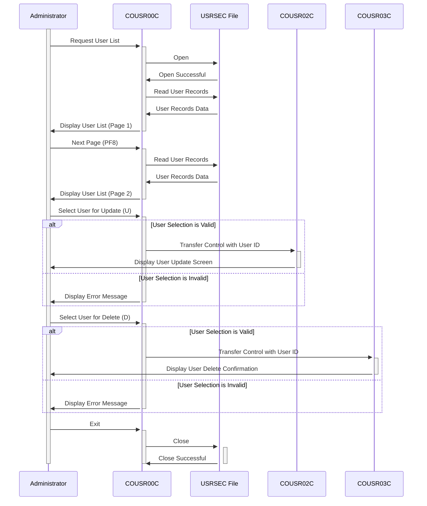

Generated at: 1st October of 2024

# CardDemo Application - User List Functionality Specification

## Summary Description

The User List functionality in the CardDemo application allows administrators to view and manage user accounts. It provides a paginated list of users, allowing administrators to browse through records, select specific users, and perform actions like updating or deleting user accounts.

## User Stories

As an administrator, I need to be able to view a list of all users in the system so that I can manage their accounts effectively.

## Related Epic

6 - User Management and Security

## Functional Requirements

- The system shall allow administrators to view a list of all users in the system.
- The user list shall include the following information for each user: User ID, First Name, Last Name, and User Type.
- The system shall display the user list in a paginated format, with a maximum of 10 users per page.
- The system shall allow administrators to navigate through the user list pages using function keys (PF7 for the previous page, PF8 for the next page).
- The system shall allow administrators to select a user from the list to perform actions such as update or delete.
- The system shall validate user selections to ensure only valid options (U/D) are processed.
- Based on the selected action, the system shall redirect the administrator to the appropriate program (COUSR02C for update, COUSR03C for delete) along with the selected user's ID.
- The system shall handle the scenario where no users are found in the USRSEC file.
- The system shall handle cases where the user attempts to navigate beyond the first or last page of the user list.

## Non-Functional Requirements

- The system shall retrieve and display the user list with minimal response time (within 2 seconds).
- The system shall be accessible to authorized personnel only, ensuring data confidentiality and security.
- The user interface shall be user-friendly and intuitive for administrators to navigate and perform actions.
- The system shall provide clear error messages in case of invalid input or system errors.

## Acceptance Criteria

- The user list functionality shall be accessible to authenticated administrators.
- The user list shall accurately display user information retrieved from the USRSEC file.
- The pagination functionality shall work correctly, allowing users to navigate through all user records.
- Administrators shall be able to select a user and perform update or delete actions successfully.
- The system shall handle errors gracefully and display appropriate messages to the user.

## Code Improvements

- Implement a more efficient sorting algorithm for displaying users, especially for large datasets.
- Improve error handling by providing more specific error messages and logging them for debugging purposes.
- Add comments to improve code readability and maintainability.
- Consider using a data structure to store user information instead of individual variables for better organization.
- Use a consistent naming convention for variables and functions to enhance code readability.

## Security Improvements

- Implement input validation to prevent SQL injection vulnerabilities.
- Encrypt sensitive user information stored in the USRSEC file to protect against unauthorized access.
- Implement access control measures to restrict user list functionality to authorized personnel only.
- Regularly audit the system to identify and address potential security vulnerabilities.

## Conceptual Diagram:

--Made by "Smart Engineering" (by Compass.UOL)--