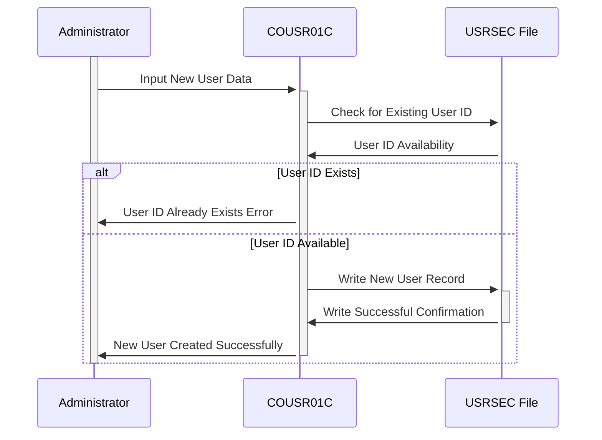

Generated at: 1st October of 2024

# **Title Document:** CardDemo User Management - Add New User Program Specification

# **Summary Description:**

This document details the "Add New User" functionality within the CardDemo system, focusing on the COUSR01C program. This program is responsible for securely registering new users, ensuring data accuracy, and enforcing security protocols.

# **User Stories:**

As an administrator, I need to be able to add new users to the system so they can access CardDemo and perform their assigned tasks.

# **Related Epic:**

6 - User Management and Security

# **Functional Requirements:**

1.  **Access Control:** The program should only be accessible to users with administrator privileges.
2.  **Data Input:** The program should provide input fields for capturing the following user information:
    *   First Name (Mandatory)
    *   Last Name (Mandatory)
    *   User ID (Mandatory, Unique)
    *   Password (Mandatory)
    *   User Type (Mandatory - "Regular" or "Admin")
3.  **Data Validation:** The program should validate the entered data for:
    *   Mandatory fields: Ensure all mandatory fields are filled.
    *   Unique User ID: Verify that the entered User ID is not already in use.
    *   Data Type: Basic data type validation (e.g., ensuring names contain only alphabetic characters).
4.  **User Data Storage:** Upon successful validation, the program should store the new user's information in the USRSEC file (user database).
5.  **Confirmation and Feedback:**
    *   Success: Display a confirmation message upon successful user creation.
    *   Error: Provide clear and specific error messages for any validation failures, guiding the administrator to correct the input.
6.  **Screen Navigation:**
    *   Provide options to navigate back to the previous screen (Admin Menu) or clear the input fields for adding another user.

# **Non-Functional Requirements:**

1.  **Security:**
    *   The program should adhere to the CardDemo Application Security Guidelines for password storage and management.
    *   Password entry should be masked to ensure confidentiality.
2.  **Performance:**
    *   The user creation process should be completed within a reasonable time frame (e.g., within 2 seconds).
3.  **Usability:**
    *   The program's interface (screen) should be easy to understand and use, with clear labels and instructions.
    *   Error messages should be concise and informative.
4.  **Maintainability:**
    *   The program code should be well-structured, documented, and follow coding standards to facilitate future maintenance.

# **Acceptance Criteria:**

1.  The program successfully adds a new user to the USRSEC file with valid data.
2.  The program prevents the creation of users with missing mandatory fields.
3.  The program prevents the creation of users with duplicate User IDs.
4.  The program provides clear and specific error messages for validation failures.
5.  The program offers intuitive screen navigation options.

# **Code Improvements:**

1.  **Error Handling:** Implement a centralized error-handling routine to manage different error scenarios more effectively.
2.  **Password Security:** Enhance password security by hashing and salting passwords before storing them in the USRSEC file.
3.  **Input Sanitization:** Implement input sanitization techniques to prevent vulnerabilities like SQL injection or cross-site scripting.
4.  **Modularity:** Refactor the code into reusable modules (subroutines or functions) for improved maintainability.
5.  **Documentation:** Add comprehensive comments to the code to explain the logic and functionality of different sections.

# **Security Improvements:**

1.  **Password Complexity:** Enforce password complexity rules (e.g., minimum length, special characters) to enhance password strength.
2.  **Access Control:** Implement role-based access control (RBAC) at a granular level to restrict access to specific functionalities based on user roles.
3.  **Logging and Auditing:** Log all user creation attempts, including successful creations and failures, for audit and security monitoring.
4.  **Secure Communication:** If the application transmits data over a network, use secure protocols (e.g., TLS/SSL) to protect sensitive information.

# **Conceptual Diagram:**

--Made by "Smart Engineering" (by Compass.UOL)--