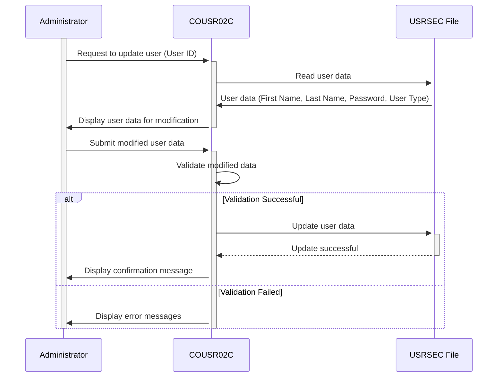

Generated at: 1st October of 2024

# CardDemo User Update Program Specification

## Summary Description

This document outlines the specifications for the COUSR02C program, which manages user updates within the CardDemo application. This program handles tasks such as retrieving user details, validating modifications, updating the user database, and providing feedback to the administrator. 

## User Stories

As a system administrator, I want to be able to update user information so that I can maintain accurate user data for the CardDemo application.

## Related Epic

6 - User Management and Security

## Functional Requirements

1. **User Data Retrieval:**
   - The program shall allow the administrator to retrieve existing user information using the user ID.
   - Upon successful retrieval, the program shall display the user's first name, last name, password, and user type.

2. **Data Modification:**
   - The program shall allow the administrator to modify the user's first name, last name, password, and user type.
   - The user ID shall not be modifiable.

3. **Input Validation:**
   - The program shall validate the modified data to ensure all mandatory fields are filled and data formats are correct.
   - Specific validation rules:
      - **User ID:** Not modifiable, must match the existing user ID.
      - **First Name:**  Mandatory, only alphabetic characters allowed.
      - **Last Name:** Mandatory, only alphabetic characters allowed.
      - **Password:**  Mandatory, should enforce complexity rules (e.g., minimum length, combination of characters).
      - **User Type:** Mandatory, must be a valid user type defined by the system (e.g., Administrator, Standard User).

4. **Database Update:**
   - If the modified data passes validation, the program shall update the user's record in the USRSEC file.

5. **Confirmation and Error Handling:**
   - The program shall display a confirmation message upon successful user update.
   - The program shall display appropriate error messages if:
      - The user ID is not found.
      - Data validation fails.
      - Errors occur during the database update process.

## Non-Functional Requirements

1. **Security:**
   - Only authorized administrators with appropriate access privileges shall be able to access and modify user information.
   - Passwords shall be stored securely using encryption.

2. **Usability:**
   - The program shall provide a user-friendly interface for administrators to view, modify, and update user information.
   - Error messages shall be clear, concise, and informative.

3. **Performance:**
   - The user update process shall be completed within a reasonable time frame (e.g., within 2 seconds).

4. **Reliability:**
   - The program shall accurately update user information in the database.
   - The program shall handle errors gracefully and prevent data corruption.

5. **Maintainability:**
   - The program shall be well-documented to facilitate future maintenance and enhancements.

## Acceptance Criteria

1. **Successful User Update:**
   - Given an existing user ID, the administrator shall be able to retrieve, modify, and update the user's information successfully.
   - The updated information shall be reflected correctly in the USRSEC file.
   - A confirmation message shall be displayed upon successful update.

2. **User ID Not Found:**
   - Given an invalid user ID, the program shall display an error message indicating that the user ID was not found.

3. **Data Validation Errors:**
   - Given invalid input data (e.g., empty mandatory fields, incorrect data formats), the program shall display appropriate error messages for each validation rule violated.

4. **Error Handling:**
   - In case of any errors during the database update process, the program shall display a generic error message and log the error details for troubleshooting.

## Code Improvements

1. **Password Complexity:**
   - Implement password complexity rules (e.g., minimum length, combination of uppercase, lowercase, numbers, special characters) to enhance system security.
   - Provide feedback to the administrator on the password complexity requirements.

2. **Password Confirmation:**
   - Prompt the administrator to enter the new password twice to prevent typos.
   - Compare the two entries and only proceed if they match.

3. **Audit Trail:**
   - Implement an audit trail to log all user updates, including:
      - User ID of the administrator making the change.
      - Timestamp of the change.
      - Fields that were modified.
      - Old and new values of the modified fields.

4. **Error Handling:**
   - Implement more specific error messages based on the type of error encountered (e.g., database connection error, record locking error).
   - Log detailed error information to a file or database for troubleshooting.

5. **Code Documentation:**
   - Add comments to explain the purpose and logic of different sections of the code.
   - Use meaningful variable names.

## Security Improvements

1. **Password Encryption:**
   - Encrypt passwords in the USRSEC file using a strong encryption algorithm to protect sensitive data from unauthorized access.
   - Do not store passwords in plain text.

2. **Input Sanitization:**
   - Sanitize all user inputs to prevent injection attacks, such as SQL injection or cross-site scripting (XSS).

3. **Access Control:**
   - Implement role-based access control (RBAC) to restrict access to the user update functionality to authorized personnel only.

## Conceptual Diagram

--Made by "Smart Engineering" (by Compass.UOL)--