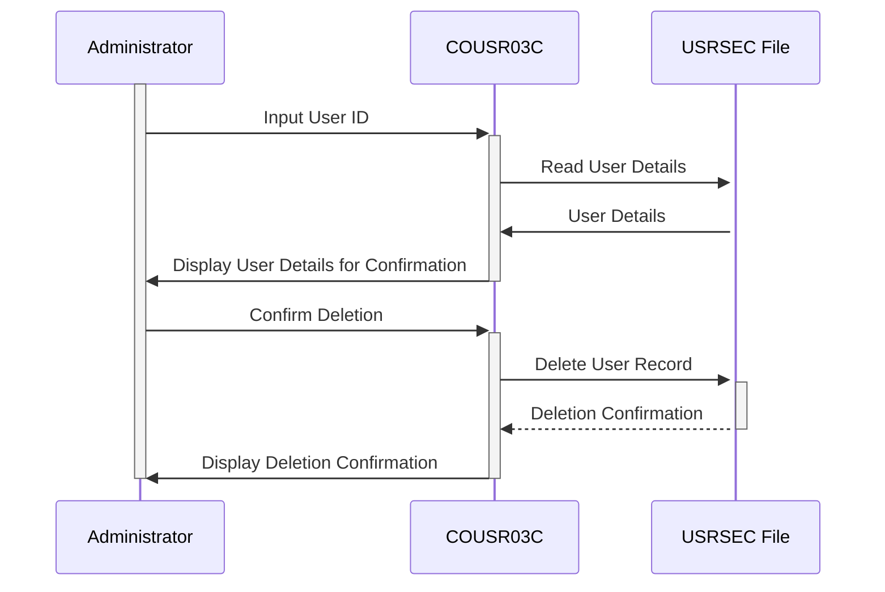

Generated at: 1st October of 2024

# CardDemo User Management - User Deletion

## Summary Description
This specification details the "User Deletion" function within the CardDemo application. This function allows authorized users (administrators) to remove user accounts securely.

## User Stories
As a system administrator, I need to be able to delete user accounts so that I can manage user access and ensure system security.

## Related Epic:
6 - User Management and Security

## Functional Requirements
* **User Identification:** The system shall allow an administrator to input a user ID to identify the account to be deleted.
* **User Verification:** The system shall retrieve and display the user's details for confirmation before deletion.
* **Deletion Confirmation:** The system shall require explicit confirmation from the administrator before deleting the user account.
* **Deletion Execution:** Upon confirmation, the system shall remove the user's record from the USRSEC file.
* **Result Communication:** The system shall display a success message upon successful deletion or an error message if the deletion fails.

**Business Rules:**
* Only authenticated administrators with appropriate permissions can delete user accounts.
* The system must verify the user ID before deletion to prevent accidental deletion of the wrong account.
* All user deletion actions must be logged for auditing purposes.

## Non-Functional Requirements
* **Security:** Only authorized personnel should be able to delete user accounts. The system should employ robust authentication and authorization mechanisms to ensure that only authorized users can access and execute this function.
* **Data Integrity:** The system should ensure that the correct user account is deleted. It should provide clear confirmation steps to the administrator before permanently removing any data.
* **Auditability:** All user deletion actions, including the user who initiated the deletion, the date and time of the action, and the user ID of the deleted account, should be logged for auditing and tracking purposes.

## Acceptance Criteria
* An authenticated administrator should be able to delete an existing user account successfully.
* The system should display a confirmation message after successful user deletion.
* The system should handle invalid user IDs gracefully and display an appropriate error message.
* The system should log all user deletion actions for audit purposes.

## Code Improvements
* Implement parameterized queries to prevent SQL injection vulnerabilities when accessing the USRSEC file.
* Add error handling for file operations to gracefully handle potential errors during file access.
* Use a logging framework to provide detailed logs for easier troubleshooting and monitoring.

## Security Improvements
* Implement strong password policies for administrator accounts.
* Enable two-factor authentication for administrator accounts to prevent unauthorized access.
* Regularly review and update access control lists for user management functions.

## Conceptual Diagram

--Made by "Smart Engineering" (by Compass.UOL)--