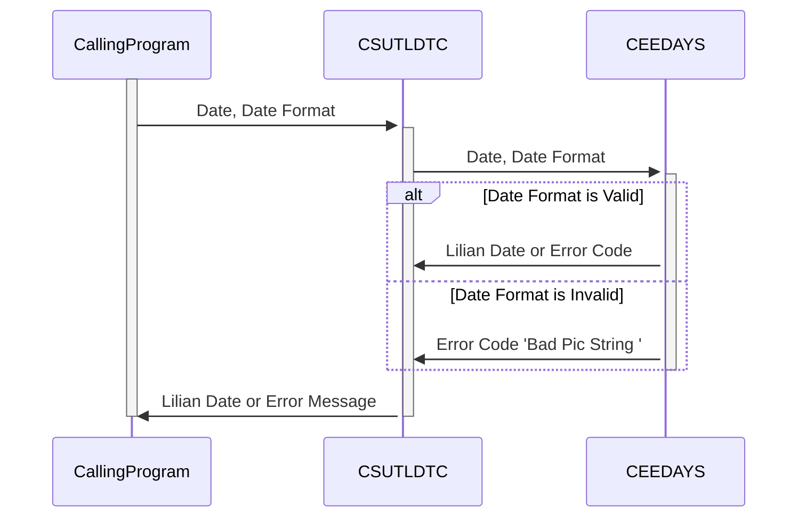

Generated at: 1st October of 2024

# CardDemo Application: Date Conversion Utility (CSUTLDTC)

## Summary Description:
This utility program, CSUTLDTC, is a critical component of the CardDemo application. Its primary function is to convert dates from various human-readable formats, such as "MM-DD-YYYY", into the Lilian format. This format, a numerical representation of the date, is essential for computers to perform calculations and comparisons efficiently.

## User Stories:
As a system administrator, I need a reliable way to convert dates from different formats into a standard format for efficient data processing and reporting.

## Related Epic:
9 - System Utilities

## Functional Requirements:
1. **Receive Date and Format:** The program should accept two inputs: the date string to be converted and the corresponding format of the input date (e.g., "MM-DD-YYYY," "DD-MM-YYYY").
2. **Validate Date Format:** It should verify if the input date format is recognized and supported by the system. If the format is invalid, the program should generate an error message "Bad Pic String " and exit.
3. **Validate Date:** The program must check the validity of the input date itself. For instance, February 30th is an invalid date and should be flagged as "Invalid month  ".
4. **Convert to Lilian Format:** If both the date and format are valid, the program should convert the input date into the Lilian format, a numerical representation of the date.
5. **Return Lilian Date or Error:** Upon successful conversion, return the Lilian date. If any validation fails, the program should return a descriptive error message indicating the issue.

## Non-Functional Requirements:
1. **Accuracy:** The conversion process must be accurate to avoid any discrepancies in date-related calculations or data inconsistencies.
2. **Performance:** The conversion process should be efficient to avoid impacting the performance of other system processes, especially when dealing with large volumes of data.
3. **Maintainability:**  The code should be well-structured and documented for easy maintenance and updates.

## Acceptance Criteria:
1. **Successful Conversion:** Given a valid date and format, the program should accurately convert the date to Lilian format.
2. **Invalid Date Format Handling:**  Given an invalid date format, the program should generate an error message "Bad Pic String ".
3. **Invalid Date Handling:** Given an invalid date, the program should generate an error message indicating the specific issue (e.g., "Invalid month  ").
4. **Error Reporting:** All error messages should be clear, concise, and helpful for troubleshooting.

## Code Improvements:
1. **Centralized Error Handling:** Implement a centralized error handling routine to manage all error conditions in a consistent and maintainable way.
2. **Enhanced Error Messages:** Provide more informative error messages, including the invalid date or format, to aid in faster debugging.
3. **Logging:** Incorporate logging capabilities to record successful conversions, errors, and other relevant information for auditing and troubleshooting.

## Security Improvements:
While this utility doesn't directly handle sensitive data, consider the following:
1. **Input Validation:**  Implement rigorous input validation to prevent any unexpected data or malicious code injection attempts.
2. **Secure Logging:**  If logs are implemented, ensure they are stored securely and access is restricted to authorized personnel only.

## Conceptual Diagram:

--Made by "Smart Engineering" (by Compass.UOL)--