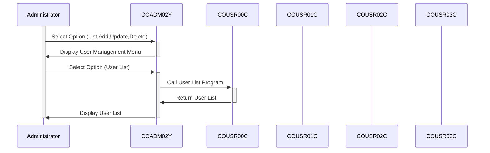

Generated at: 1st October of 2024

# **Title Document:** CardDemo Application - Administrative User Management Menu Specification

# **Summary Description:**
This document outlines the specifications for the "User Management" administrative menu within the CardDemo application. This menu is a critical component of the system's security framework, providing authorized personnel with tools to manage user accounts and their associated permissions. 

# **User Stories:**
As a system administrator, I need to be able to manage user accounts so that I can control access to the CardDemo application.

# **Related Epic:**
6 - User Management and Security

# **Functional Requirements:**
The "User Management" menu shall provide the following functionalities:
* **User List:** 
    - Display a list of all existing user accounts, including usernames, user IDs, and access levels.
    - Allow administrators to search for specific users based on username or user ID.
* **User Add:**
    - Allow administrators to create new user accounts by providing a unique username, password, and access level.
    - Enforce password complexity rules to ensure the security of new accounts.
* **User Update:**
    - Allow administrators to modify existing user information, such as usernames, passwords, and access levels.
    - Log all changes made to user accounts for audit purposes.
* **User Delete:**
    - Allow administrators to delete existing user accounts.
    - Require confirmation before deleting an account to prevent accidental deletions.

# **Non-Functional Requirements:**
* **Security:** 
    - The "User Management" menu shall be accessible only to authenticated and authorized administrators.
    - User credentials shall be stored securely using encryption or hashing algorithms.
* **Performance:**
    - The menu should load and respond to user actions quickly, with minimal latency.
* **Usability:**
    - The menu shall have a user-friendly interface that is easy to navigate and understand.
* **Reliability:**
    - The menu should function reliably and consistently, without errors or unexpected behavior.

# **Acceptance Criteria:**
* The "User Management" menu shall be successfully integrated into the CardDemo application.
* All functionalities of the menu shall be tested and verified to work as expected.
* The menu shall meet all specified security, performance, usability, and reliability requirements.
* System administrators shall be able to use the menu to effectively manage user accounts and control access to the CardDemo application.

# **Code Improvements:**
* **Error Handling:** Implement robust error handling to gracefully handle unexpected situations, such as database connection failures or invalid user inputs.
* **Logging:** Enhance logging to capture all user actions, system events, and errors for auditing and troubleshooting purposes.
* **Documentation:** Provide comprehensive documentation for the menu's code, functionalities, and configuration to facilitate maintenance and future enhancements.

# **Security Improvements:**
* **Input Validation:** Implement strict input validation to prevent SQL injection and other security vulnerabilities.
* **Session Management:** Implement secure session management to protect user accounts from unauthorized access.
* **Password Policy:** Enforce a strong password policy that requires users to create passwords that meet certain complexity requirements.

# **Conceptual Diagram:**

--Made by "Smart Engineering" (by Compass.UOL)--