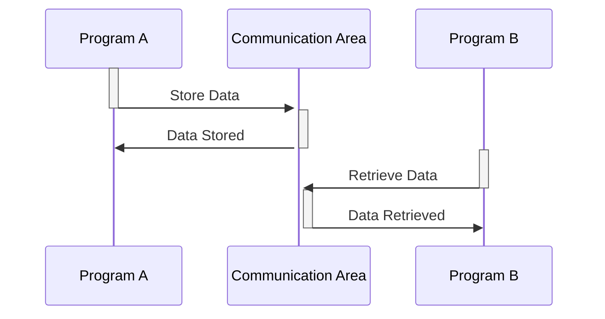

Generated at: 1st October of 2024

**Title Document:** CardDemo Application - Inter-Program Communication Area Specification

**Summary Description:**
The CardDemo application uses a common communication area to share information between its different programs. This area, defined in the COCOM01Y.cpy file, acts as a messenger, carrying important details like customer data, account information, and user details between various parts of the application.

**User Stories:**
As a CardDemo application developer, I need a standardized way to exchange information between different programs so that data can be shared consistently and reliably.

**Related Epic:**
9 - System Utilities

**Functional Requirements:**
- The communication area should store general information about the transaction, including the sending and receiving programs, the user ID, and the type of user (admin or regular).
- Customer-specific information, such as the customer ID, name, and account details, should be included in the communication area.
- The communication area should be accessible to all programs within the CardDemo application.

**Non-Functional Requirements:**
- The communication area should be designed for efficient data exchange, minimizing overhead and maximizing performance.
- Data integrity should be maintained by ensuring that all programs use the same data definitions and formats.

**Acceptance Criteria:**
- The communication area is successfully used by different programs within the CardDemo application to exchange data.
- Data integrity is maintained, and there are no instances of data corruption or misinterpretation.
- The use of a common communication area does not negatively impact application performance.

**Code Improvements:**
- Implement data validation checks within the communication area to ensure that the data being passed between programs is accurate and consistent.
- Add error handling routines to gracefully manage situations where data is missing or invalid.
- Document the structure and usage of the communication area to facilitate maintenance and future development.

**Security Improvements:**
- Encrypt sensitive information, such as credit card numbers, before storing it in the communication area.
- Implement access control mechanisms to restrict access to sensitive data based on user roles and permissions.
- Regularly audit the use of the communication area to detect any unauthorized access or suspicious activity.

**Conceptual Diagram:**

--Made by "Smart Engineering" (by Compass.UOL)--