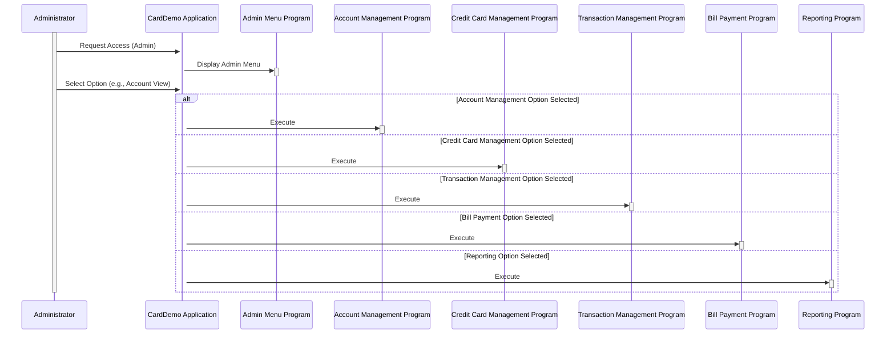

Generated at: 1st October of 2024

**Title Document:** CardDemo Application - Admin Menu Options Specification

**Summary Description:**
The CardDemo Application's Admin Menu provides a list of functionalities for managing various aspects of the credit card system. Upon logging in, administrators can choose from options such as viewing and updating accounts, managing credit card details, handling transactions, processing bill payments, and accessing reports. Each option corresponds to a specific program within the system.

**User Stories:**
As an administrator, I need access to a centralized menu to efficiently manage different aspects of the credit card system, such as accounts, cards, transactions, and reports.

**Related Epic:**
6 - User Management and Security

**Functional Requirements:**
- The Admin Menu should only be accessible after successful administrator authentication.
- The menu should display a numbered list of options to the administrator.
- Each menu option should have a clear and concise description.
- Selecting a menu option should execute the associated program or module.
- The system should handle invalid menu selections gracefully and provide appropriate feedback to the user.

**Non-Functional Requirements:**
- The Admin Menu should load quickly and respond promptly to user selections.
- The menu structure should be easy to understand and navigate.
- The system should be designed to allow for easy updates and modifications to the Admin Menu options in the future.

**Acceptance Criteria:**
- Only authenticated administrators can access the Admin Menu.
- The menu displays all required options with accurate descriptions.
- Selecting an option correctly launches the associated program.
- The system handles invalid selections and provides informative messages.

**Code Improvements:**
- **Dynamic Menu Structure:** Instead of hardcoding menu options, implement a database-driven approach. This allows for easier updates, role-based customization, and potential for a more dynamic menu structure in the future.
- **Enhanced Error Handling:** Implement centralized error handling with detailed logging for easier troubleshooting. Provide user-friendly error messages instead of system-level codes.
- **Consider GUI:**  If a GUI is planned, design an intuitive interface for the Admin Menu with clear visual cues and easy navigation.

**Security Improvements:**
- **Input Validation:** Implement robust input validation on menu selections to prevent injection vulnerabilities.
- **Authorization Checks:** Before executing any program linked to a menu option, verify the user's permissions for that specific action. 
- **Logging:** Log all access attempts and actions performed within the Admin Menu for auditing purposes.

**Conceptual Diagram:**

--Made by "Smart Engineering" (by Compass.UOL)--