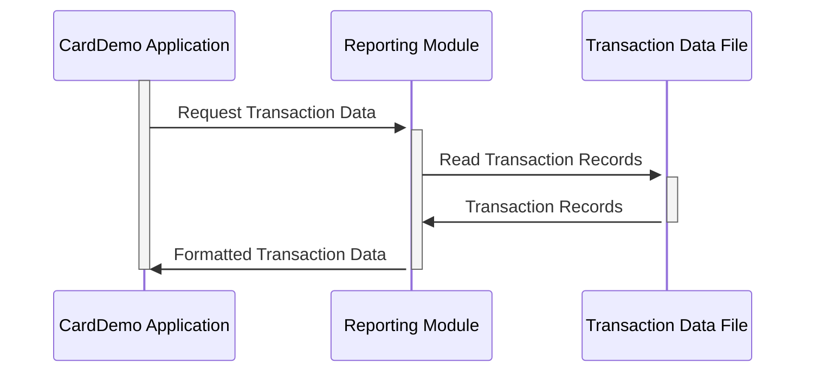

Generated at: 1st October of 2024

# **Title Document:** CardDemo Transaction Reporting Data Structure

# **Summary Description:**
This document defines the data structure used in the CardDemo application for reporting credit card transactions. It ensures consistent and organized data for generating various reports.

# **User Stories:**
As a data analyst, I need a standardized transaction data structure to generate accurate and consistent reports on credit card activity.

# **Related Epic:**
5 - Reporting and Analytics

# **Functional Requirements:**
- The data structure must include fields to identify each transaction uniquely, such as card number and transaction ID.
- It should categorize transactions by type (e.g., purchase, refund) and category (e.g., groceries, travel).
- The structure must store relevant merchant information, including ID, name, city, and ZIP code.
- It should record transaction amounts accurately, including decimal places for cents.
- The structure must capture timestamps for transaction initiation and processing.

# **Non-Functional Requirements:**
- **Data Integrity:** The data structure must ensure data accuracy and consistency through appropriate data types and validation rules.
- **Performance:**  The structure should be designed to facilitate efficient data retrieval and processing for report generation.

# **Acceptance Criteria:**
- The data structure accurately represents all necessary information for credit card transaction reporting.
- Reports generated using this structure are consistent, accurate, and easily interpretable.

# **Code Improvements:**
- Implement data validation rules within the application to enforce data integrity at the point of entry.
- Add error handling mechanisms to gracefully manage invalid data and prevent system disruptions.

# **Security Improvements:**
- Encrypt sensitive data within the transaction records, such as card numbers, to protect against unauthorized access.
- Implement access controls to restrict data viewing and modification privileges to authorized personnel only.

# **Conceptual Diagram:**

--Made by "Smart Engineering" (by Compass.UOL)--