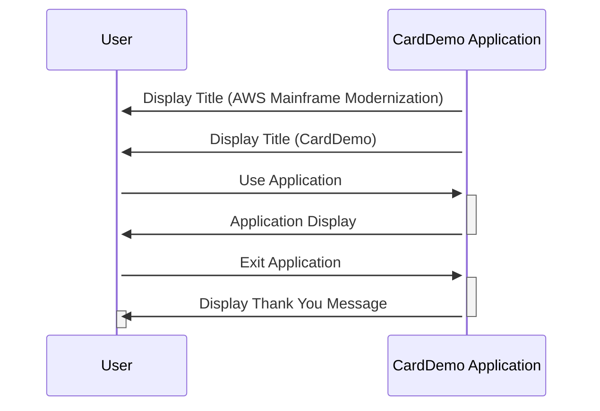

Generated at: 1st October of 2024

# **Title Document:** CardDemo Application - Screen Titles and Messages

# **Summary Description:** 
This document outlines the screen titles and messages used in the CardDemo application, a COBOL-based credit card management system. It focuses on enhancing user experience by providing clear branding and friendly messages.

# **User Stories:** 
As a user, I want to see clear and informative titles and messages so that I can understand the application's purpose and navigate it easily.

# **Related Epic:** 
9 - System Utilities

# **Functional Requirements:**
- The application should display "AWS Mainframe Modernization" on the first line of the title bar.
- The application should display "CardDemo" on the second line of the title bar.
- Upon exiting, the application should display a "Thank You" message to the user.

# **Non-Functional Requirements:**
- The titles and messages should be displayed in a clear and readable font.
- The "Thank You" message should be displayed for a reasonable amount of time before the application closes.

# **Acceptance Criteria:**
- The specified titles and messages are displayed correctly on the respective screens.
- The font and display duration of the messages meet the defined standards.

# **Code Improvements:**
-  **Externalize Strings:**  Instead of hardcoding the titles and messages within the program, store them in an external file or database. This allows for easier modification of the text without recompiling the program.
- **Multilingual Support:**  Consider adding support for multiple languages, allowing the application to display titles and messages in the user's preferred language. 

# **Security Improvements:**
- N/A - This component focuses on user interface elements and does not directly involve sensitive data or security functions.

# **Conceptual Diagram:**

--Made by "Smart Engineering" (by Compass.UOL)--