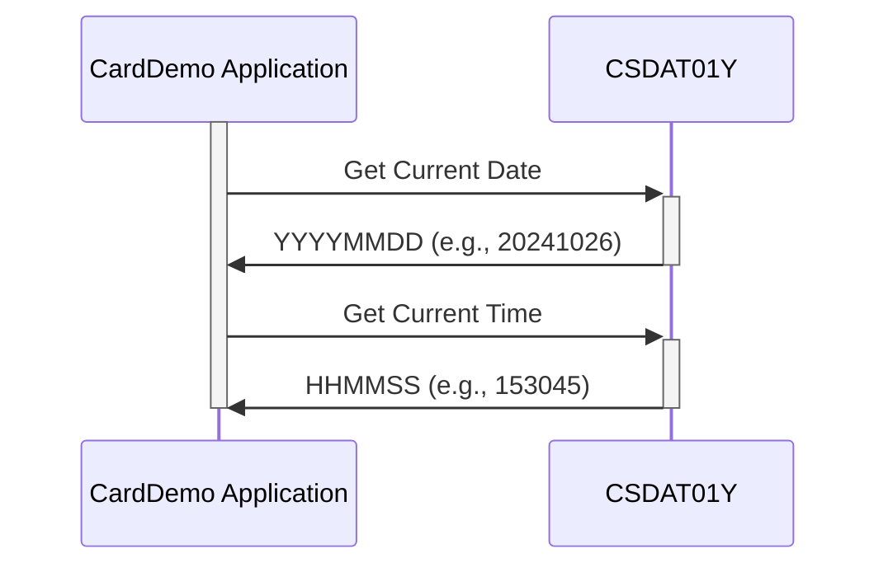

Generated at: 1st October of 2024

**Title Document:** CardDemo Application - Date and Time Standard Specification

**Summary Description:**
This document outlines the standardized format for handling date and time information within the CardDemo application. It ensures consistency and accuracy in recording, displaying, and processing dates and times across all system functionalities.

**User Stories:**
As a Data Analyst, I need to ensure that all dates and times are recorded and processed consistently across the CardDemo application to maintain data accuracy and generate reliable reports.

**Related Epic:** 9 - System Utilities

**Functional Requirements:**
The code defines a standard structure for representing date and time information within the CardDemo application. 
- It establishes specific containers to hold year, month, day, hour, minute, second, and millisecond values.
- The code supports different display formats for dates (YYYY-MM-DD, MM/DD/YY) and times (HH:MM:SS), ensuring compatibility with various input/output sources.
- It handles the conversion of these human-readable formats into a consistent internal representation that the system can efficiently use for calculations and comparisons.

**Business Rules:**
* **Accuracy:** All modules must adhere to the defined formats to ensure accurate date and time recording and processing.
* **Consistency:**  The same format should be used consistently across the application to avoid discrepancies and ensure data integrity.

**Non-Functional Requirements:**
- **Performance:** Date and time operations should be performed efficiently to avoid impacting the overall system performance.
- **Maintainability:** The code should be well-documented and easy to understand for future maintenance and enhancements.
- **Reliability:** The date and time handling mechanism should be reliable and produce consistent results across different parts of the application.

**Acceptance Criteria:**
- All modules within the CardDemo application should consistently use the defined date and time formats.
- Date and time operations should be performed accurately and efficiently.
- The system should be able to handle different display formats for dates and times.

**Code Improvements:**
- Add comments to clarify the purpose and usage of each variable and data structure.
- Implement error handling for cases where invalid date or time values are encountered.
- Consider using a dedicated date and time library for improved functionality and maintainability.

**Security Improvements:**
- Ensure that sensitive date and time information, if any, is handled securely and protected from unauthorized access.
- Implement logging and auditing mechanisms to track changes made to date and time data.

**Conceptual Diagram:**

--Made by "Smart Engineering" (by Compass.UOL)--