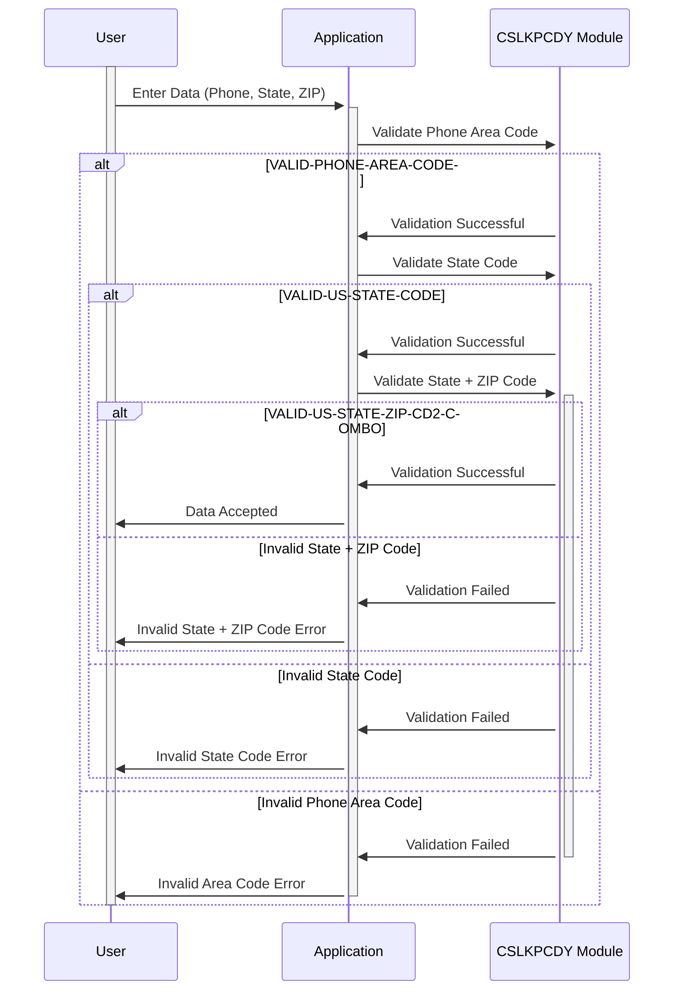

Generated at: 1st October of 2024

# Data Integrity Guardian - Lookup Code Repository Specification

## Summary Description:

This module ensures data integrity within the CardDemo application by validating user-entered phone numbers, US state codes, and ZIP codes against predefined lists of acceptable values. This validation process is crucial for maintaining accurate customer and transaction records, ensuring compliance with telecommunications standards, and supporting reliable address-related operations.

## User Stories:

As a data analyst, I need to be confident that the phone numbers, state codes, and ZIP codes stored in the system are accurate and consistent, so I can perform reliable analysis and reporting without encountering data quality issues.

## Related Epic:

9 - System Utilities

## Functional Requirements:

1. **Phone Area Code Validation:**
    - The system shall validate the entered phone area code against a list of valid North American area codes.
    - If the entered area code is present in the list, the validation passes.
    - If the entered area code is not found in the list, the validation fails, and the system shall display an error message to the user.
2. **US State Code Validation:**
    - The system shall validate the entered two-letter US state code against a list of valid state codes.
    - If the entered state code is present in the list, the validation passes.
    - If the entered state code is not found in the list, the validation fails, and the system shall display an error message to the user.
3. **State + ZIP Code Validation:**
    - The system shall validate the combination of the entered US state code and the first two digits of the ZIP code against a list of valid state + ZIP code combinations.
    - If the entered combination is present in the list, the validation passes.
    - If the entered combination is not found in the list, the validation fails, and the system shall display an error message to the user.

## Non-Functional Requirements:

1. **Performance:**
    - The validation process should be performed in real-time (during data entry) without introducing noticeable delays for the user.
    - The lookup time for validating codes should be minimal to ensure a responsive user experience.
2. **Reliability:**
    - The validation process should be reliable and consistent, ensuring that only valid codes are accepted.
    - The lookup lists should be regularly updated to reflect any changes in valid codes.
3. **Maintainability:**
    - The code for the validation module should be well-structured, documented, and easily maintainable.
    - The lookup lists should be stored in a centralized location for easy access and modification.
4. **Security:**
    - Access to modify the lookup lists should be restricted to authorized personnel only.
    - The integrity of the lookup lists should be maintained to prevent unauthorized modifications.

## Acceptance Criteria:

1. The system successfully validates phone area codes against the predefined list and displays appropriate error messages for invalid entries.
2. The system successfully validates US state codes against the predefined list and displays appropriate error messages for invalid entries.
3. The system successfully validates the combination of US state codes and the first two digits of ZIP codes against the predefined list and displays appropriate error messages for invalid entries.
4. The validation process is performed in real-time without noticeable performance degradation.
5. The lookup lists are regularly updated to reflect any changes in valid codes.

## Code Improvements:

1. **Error Handling:** Implement a standardized error handling mechanism that provides detailed information about the validation failure, such as the specific invalid code and the corresponding field.
2. **Documentation:** Add comprehensive documentation to the code, explaining the validation logic, the purpose of each lookup list, and any relevant business rules.
3. **Performance Optimization:** Explore techniques for optimizing the lookup process, such as using efficient data structures or caching mechanisms, to further improve performance.

## Security Improvements:

1. **Access Control:** Implement strict access control measures to ensure that only authorized personnel can modify the lookup lists.
2. **Audit Trail:** Maintain an audit trail that logs all modifications made to the lookup lists, including the user who made the change, the timestamp, and the specific changes made.
3. **Regular Security Assessments:** Conduct regular security assessments to identify and mitigate any potential vulnerabilities related to the validation module.

## Conceptual Diagram:

--Made by "Smart Engineering" (by Compass.UOL)--