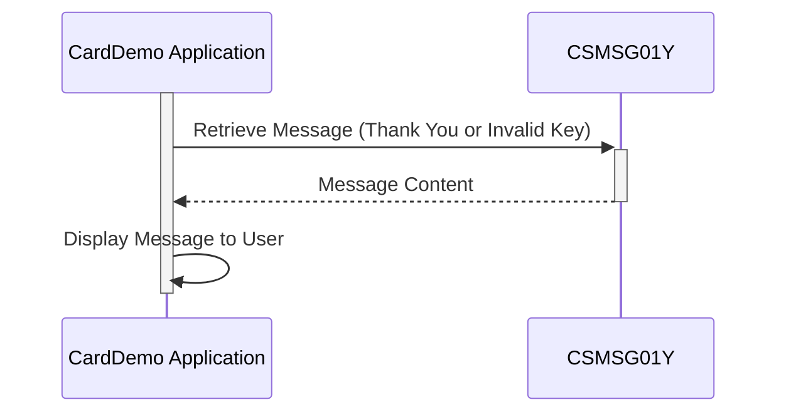

Generated at: 1st October of 2024

# **Title Document:** CardDemo Application - Common Message Repository Specification

# **Summary Description:**

This document describes the functionality of the `CSMSG01Y.cpy` file within the CardDemo application. This file acts as a central repository for common user messages, ensuring consistency in communication throughout the application.

# **User Stories:**

As an application developer, I need pre-defined messages to provide clear and consistent feedback to users about their actions within the CardDemo application.

# **Related Epic:**

9 - System Utilities

# **Functional Requirements:**

- The system shall provide pre-defined messages for common user interactions, such as successful operations and invalid input.
- The messages shall be stored in a central location accessible to different parts of the application.

# **Non-Functional Requirements:**

- Messages should be clear, concise, and easily understandable by the end-users.
- The message repository should be maintainable and scalable to accommodate future message additions or modifications.

# **Acceptance Criteria:**

- The `CSMSG01Y.cpy` file should contain the defined messages for a "Thank You" message and an "Invalid Key" message.
- The messages should be used consistently across the CardDemo application where applicable.

# **Code Improvements:**

-   **Multilingual Support:**  Consider adding support for multiple languages to make the CardDemo application accessible to a wider audience.  This could involve using variables to store messages in different languages and a mechanism to select the appropriate language based on user preferences or system settings. 
-   **Message Customization:** Explore allowing limited customization of messages to align with specific business requirements.  For example, you could allow changing the application name in the thank you message while preserving the overall structure and tone. 

# **Security Improvements:**

- No direct security improvements are necessary for this specific file as it doesn't handle sensitive data. However, ensure that any data displayed to the user using these messages is appropriately sanitized and protected to prevent vulnerabilities like cross-site scripting (XSS).

# **Conceptual Diagram:**

--Made by "Smart Engineering" (by Compass.UOL)--