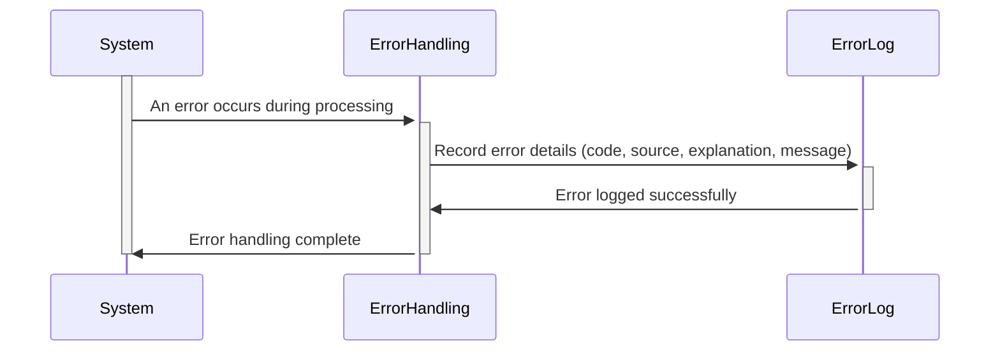

Generated at: 1st October of 2024

# **Title Document:** Card System Error Logging Specification

# **Summary Description:**
This specification defines a standardized format for logging errors within the Card System. It ensures consistent error reporting, simplifies problem diagnosis, and contributes to overall system stability. When an error occurs, the system captures key details, including an error code, the source program, a detailed explanation, and a general message. 

# **User Stories:**
As a System Administrator, I need a standardized way to understand system errors so that I can quickly identify and resolve issues affecting the Card System.

# **Related Epic:**
9 - System Utilities

# **Functional Requirements:**
1.  **Error Capture:** The system shall capture the following information when an error occurs:
    - **Error Code (ABEND-CODE):** A 4-character code categorizing the error type (e.g., "DBER" for Database Error, "CNVL" for Conversion Error).
    - **Source Program (ABEND-CULPRIT):** The name of the program or module where the error originated (e.g., "COACTUPC", "CBTRN01C").
    - **Error Explanation (ABEND-REASON):** A concise explanation of the error's cause (e.g., "Invalid account number", "File not found").
    - **General Message (ABEND-MSG):** A user-friendly message associated with the error (e.g., "An error occurred during transaction processing. Please try again later.").

# **Non-Functional Requirements:**
1.  **Performance:** Error logging should have minimal impact on the system's overall performance.
2.  **Reliability:** The error logging mechanism must be reliable, ensuring that all errors are captured and logged without fail.
3.  **Maintainability:** The error logging code and data structures should be easily maintainable and extensible to accommodate future changes.

# **Acceptance Criteria:**
1.  **Complete Error Information:** All error log entries must contain the required information: Error Code, Source Program, Error Explanation, and General Message.
2.  **Accurate Error Reporting:** The logged information should accurately reflect the nature and source of the error.
3.  **Timely Logging:** Errors should be logged promptly upon detection to provide a real-time view of system health.

# **Code Improvements:**
1.  **Centralized Error Handling:** Implement a centralized error handling routine to ensure consistency and reduce code duplication.
2.  **Error Code Standardization:** Define a comprehensive and standardized set of error codes to facilitate analysis and reporting.
3.  **Logging Levels:** Introduce different logging levels (e.g., DEBUG, INFO, ERROR, FATAL) to control the verbosity of logs.

# **Security Improvements:**
1.  **Secure Log Storage:** Store error logs securely to prevent unauthorized access and modification.
2.  **Log Monitoring and Auditing:** Implement mechanisms to monitor error logs for suspicious activities and generate audit trails.
3.  **Data Minimization:** Avoid logging sensitive information, such as customer data or passwords, in error logs.

# **Conceptual Diagram:**

--Made by "Smart Engineering" (by Compass.UOL)--