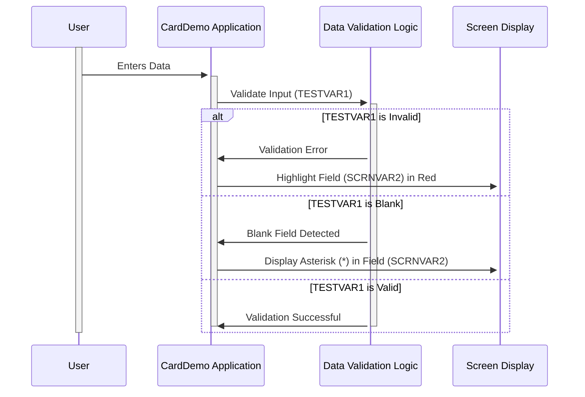

Generated at: 1st October of 2024

# **Title Document:** CardDemo Field Validation Specification

# **Summary Description:**
This document details the functionality of a code snippet within the CardDemo application. Its primary function is to provide visual feedback to users during data entry, ensuring data accuracy by highlighting potential errors and guiding users to complete mandatory fields.

# **User Stories:**
As a Customer Service Representative, I need clear visual cues on the screen to understand if the data I entered is correct and complete, so I can avoid mistakes and ensure data accuracy in the system.

# **Related Epic:**
9 - System Utilities

# **Functional Requirements:**

- **FR 01:** The system shall validate user input in real-time as data is entered.
- **FR 02:** If the entered data is invalid, the corresponding field on the screen shall be highlighted in red.
- **FR 03:** If a mandatory field is left blank, an asterisk (*) shall be displayed within the field.

## **Business Rules:**

- **BR 01:** Data validation rules for each field shall be predefined and consistently applied.
- **BR 02:** Mandatory fields are defined by system design and cannot be bypassed by the user.
- **BR 03:** Visual feedback (red highlight and asterisk) should be clear, immediate, and noticeable to the user.

# **Non-Functional Requirements:**

- **NFR 01:** The field validation process should not significantly impact system performance.
- **NFR 02:** The visual feedback should be consistent across different screen resolutions and devices.
- **NFR 03:** The validation logic should be maintainable and easily adaptable to future changes in business rules.

# **Acceptance Criteria:**

- **AC 01:** The system successfully highlights invalid data fields in red upon entry.
- **AC 02:** An asterisk (*) is correctly displayed in mandatory fields that are left blank.
- **AC 03:** The validation process does not cause noticeable delays or disruptions in system performance.
- **AC 04:** The visual feedback is accessible to users with visual impairments (e.g., alternative color schemes or screen reader compatibility).

# **Code Improvements:**

- **CI 01:** Implement centralized error handling to manage and log validation errors consistently.
- **CI 02:** Add comprehensive documentation to the code snippet explaining the validation logic, business rules, and any dependencies.
- **CI 03:** Explore performance optimization techniques if the validation process causes noticeable delays, especially for large datasets or complex validation rules.

# **Security Improvements:**

- **SI 01:** Ensure that sensitive data within the validated fields (e.g., passwords, credit card numbers) is handled securely, following best practices for data encryption and masking.
- **SI 02:** Implement input sanitization techniques to prevent vulnerabilities like cross-site scripting (XSS) attacks, where malicious code could be injected through user input fields.
- **SI 03:** Log validation failures to track potential malicious attempts or system errors for security auditing purposes.

# **Conceptual Diagram:**

--Made by "Smart Engineering" (by Compass.UOL)--