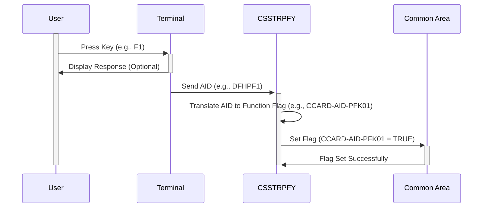

Generated at: 1st October of 2024

# **Title Document:** CICS User Action Translator

# **Summary Description:**
This program translates user actions, such as key presses on a terminal, into specific commands within a CICS application. It acts like a decoder, converting user input into instructions the application can understand.

# **User Stories:**
As an application developer, I need a way to consistently interpret user actions across different types of terminals so that the application behaves predictably for all users.

# **Related Epic:**
9 - System Utilities

# **Functional Requirements:**
1. **Capture User Input:**
   - The program should capture the Attention Identifier (AID) generated by the user's action on the terminal. This AID represents a specific key press or other input event.
2. **Translate AID to Program Function:**
   - The program should have a predefined mapping between AIDs and corresponding program functions. 
   - For example:
      - `DFHENTER` (Enter key) maps to `CCARD-AID-ENTER`
      - `DFHCLEAR` (Clear key) maps to `CCARD-AID-CLEAR`
      - `DFHPA1` (PA1 key) maps to `CCARD-AID-PA1`
      - `DFHPF1` (F1 key) maps to `CCARD-AID-PFK01`
      - and so on for other function keys.
3. **Set Flags in Common Area:**
   - Instead of directly executing the program function, the program should set a corresponding flag in a designated common area (shared memory).
   - This flag indicates the user's intended action to other parts of the CICS application.

# **Non-Functional Requirements:**
1. **Performance:** The translation process should be very fast as it's part of user interaction. Any delays will be noticeable.
2. **Reliability:** The mapping between AIDs and program functions must be accurate and consistent.
3. **Maintainability:** The code should be structured to easily add new AIDs or modify existing mappings as the application evolves. 

# **Acceptance Criteria:**
1. The program successfully captures AIDs generated by user actions on the terminal.
2. The program correctly translates captured AIDs into their corresponding program function flags.
3. The program sets the correct flags in the common area without error.

# **Code Improvements:**
1. **Error Handling:**
   - Implement checks for unexpected AIDs. If an unrecognized AID is encountered, log the error and potentially display a generic message to the user.
2. **Centralized Mapping:**
   - Consider using a table or configuration file to store the AID-to-function mapping instead of hardcoding it within the `EVALUATE` statement. This will make it easier to update the mappings without modifying the program code.
3. **Documentation:**
   - Clearly document the purpose of the program, the AID-to-function mapping, and the location and purpose of the flags in the common area.

# **Security Improvements:**
1. **Access Control:**
   - Ensure that only authorized users or programs have access to modify the common area where the flags are stored.
2. **Input Validation:**
   - Sanitize and validate all input received from the terminal to prevent injection attacks, even though AIDs are typically system-generated.

# **Conceptual Diagram:**

--Made by "Smart Engineering" (by Compass.UOL)--