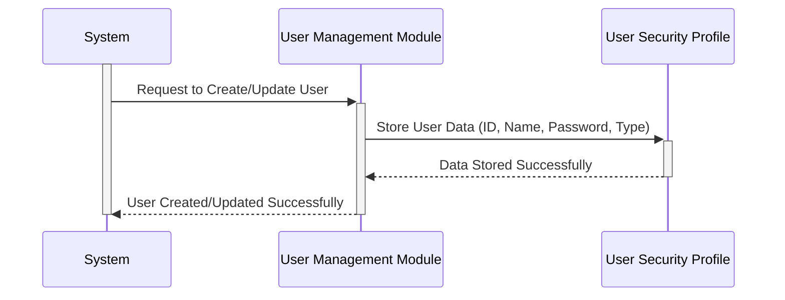

Generated at: 1st October of 2024

**Title Document:** User Security Profile - Data Structure Specification

**Summary Description:** 
This document describes the structure for storing user information securely in the CardDemo application. This structure defines how user data, like their ID, name, password, and access level, are organized and stored.

**User Stories:** 
As a system administrator, I need a secure way to store user information, including their login credentials and access rights, to ensure only authorized individuals can access sensitive data and functionalities.

**Related Epic:**  
6 - User Management and Security

**Functional Requirements:**
- The system must store a unique ID for each user.
- The system must store the user's first and last names.
- The system must store a password for each user.
- The system must store a code indicating the user's type or access level.
- The system should include space for potential future expansion of user data.

**Non-Functional Requirements:**
- **Security:** User passwords must be stored securely to prevent unauthorized access. This may involve encryption or hashing techniques, which are not detailed in this specific data structure.
- **Performance:** Retrieving user information should be efficient to ensure optimal system performance.
- **Data Integrity:** The system should enforce data validation rules to maintain the accuracy and consistency of user data.

**Acceptance Criteria:**
- The system can successfully store and retrieve all the defined user data fields.
- User passwords are treated as confidential and are not displayed in plain text.
- The system can differentiate users based on their type and control access to functionalities accordingly.

**Code Improvements:**
- **Password Security:** Implement a robust password hashing algorithm to protect user credentials from unauthorized access.
- **Data Validation:** Add input validation checks to ensure the data entered for each field meets the required format and length.
- **Documentation:** Provide clear comments within the code to explain the purpose of each field and any security considerations.

**Security Improvements:**
- **Encryption:** Consider encrypting sensitive user data, especially passwords, both in transit and at rest.
- **Access Control:** Implement strict access control measures to restrict who can view, modify, or delete user data.
- **Auditing:** Log all actions related to user data, such as creation, modification, and access attempts, for security auditing purposes.

**Conceptual Diagram:**

--Made by "Smart Engineering" (by Compass.UOL)--