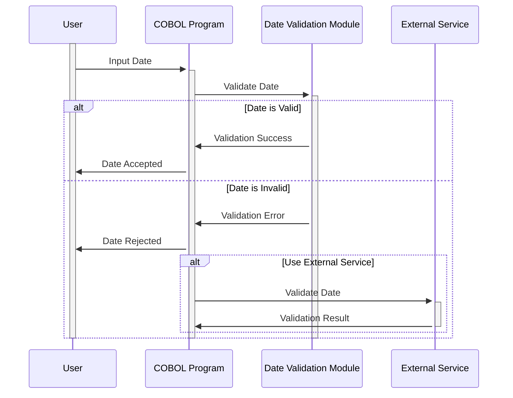

Generated at: 1st October of 2024

# CardDemo Application - Date Validation Module

## Summary Description

This module ensures that dates entered into the CardDemo system are valid and logical. It prevents incorrect dates from causing issues in other parts of the application, such as calculating interest or determining credit card eligibility. 

## User Stories

As a data analyst, I want to ensure that all dates in the system are accurate so that my analysis and reports are based on reliable data.

## Related Epic

9 - System Utilities

## Functional Requirements

- The module should validate dates entered in the format YYYYMMDD.
- It should check if the year is within a reasonable century (19xx or 20xx).
- It should verify if the month is between 1 and 12.
- It should ensure that the day is valid for the given month (e.g., not February 31st).
- It should handle leap years correctly, accepting February 29th only in leap years.
- It should prevent future dates of birth from being entered.
- It should have the option to use an external service (`CSUTLDTC`) for additional date validation if required.

## Non-Functional Requirements

- The module should be reliable and accurate in validating dates.
- It should be efficient and not negatively impact the performance of the CardDemo application.
- The code should be well-documented and maintainable.

## Acceptance Criteria

- The module should successfully validate valid dates and reject invalid dates based on the defined rules.
- The module should provide clear error messages when validation fails, indicating the specific issue with the date.
- The module should integrate seamlessly with other parts of the CardDemo application that require date validation.

## Code Improvements

- Implement a centralized error handling mechanism to provide consistent and user-friendly error messages.
- Add more detailed comments to the code to improve readability and maintainability.
- Explore performance optimization techniques, such as using binary search for date range checks if necessary.

## Security Improvements

- Ensure that access to the date validation module and its underlying data is restricted to authorized personnel only.
- Sanitize all inputs to the module to prevent vulnerabilities like SQL injection.

## Conceptual Diagram

--Made by "Smart Engineering" (by Compass.UOL)--