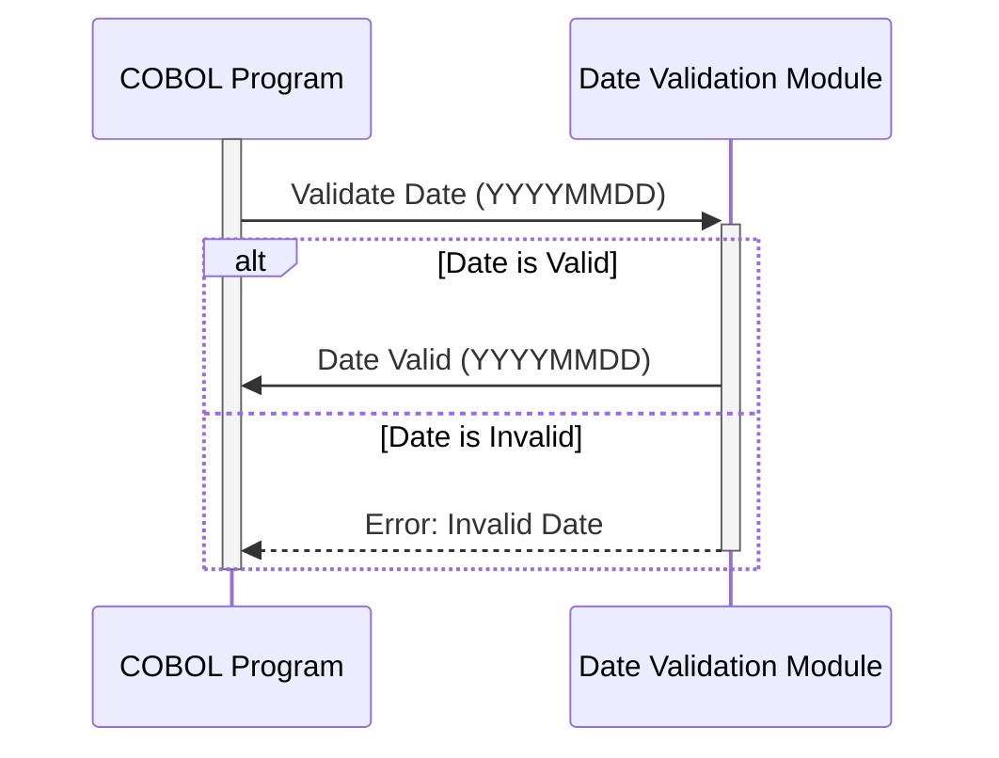

Generated at: 1st October of 2024

# **Title Document:** Date Validation and Standardization Module

# **Summary Description:**
 This COBOL code defines a reusable module for validating and standardizing date information. It ensures that dates are logically valid (e.g., valid month, day within the month, leap year handling) and can be formatted into a consistent output format.

# **User Stories:**
As a data analyst, I need to ensure that all dates used in reports and analysis are accurate and consistent, so I need a reliable way to validate and standardize date information from various sources.

# **Related Epic:**
9 - System Utilities

# **Functional Requirements:**
- **Date Validation:**
    - Validate year, month, and day components of a date.
    - Ensure the month is within the valid range (1-12).
    - Verify the day falls within the correct range for the given month, considering leap years.
    - Handle century information accurately (e.g., '20' for 21st century, '19' for 20th century).
- **Date Formatting:**
   - Format validated dates into a standardized output format (e.g., YYYYMMDD).

# **Non-Functional Requirements:**
 - **Reusability:** The module should be designed as a COBOL copybook for easy inclusion in other programs.
 - **Maintainability:** The code should be well-structured and documented for easy maintenance and updates.
 - **Performance:** Date validation and formatting should be efficient, especially when handling large volumes of data.

# **Acceptance Criteria:**
- The module correctly validates a variety of date inputs, including valid and invalid dates, leap years, and different century representations.
- Dates are accurately formatted into the specified output format (YYYYMMDD).
- Error handling is in place to identify and log invalid date values.
- The module can be easily integrated into other COBOL programs.

# **Code Improvements:**
- **Detailed Error Messages:** Provide more specific error messages to aid in debugging (e.g., "Invalid month: XX").
- **Date Calculation Functions:** Consider adding functions for common date calculations (e.g., adding/subtracting days, calculating the difference between dates).
- **Configuration Options:** Allow for configuration of the output date format.

# **Security Improvements:**
- **Input Sanitization:** Implement input validation to prevent vulnerabilities like buffer overflows or injection attacks.

# **Conceptual Diagram:**

--Made by "Smart Engineering" (by Compass.UOL)--