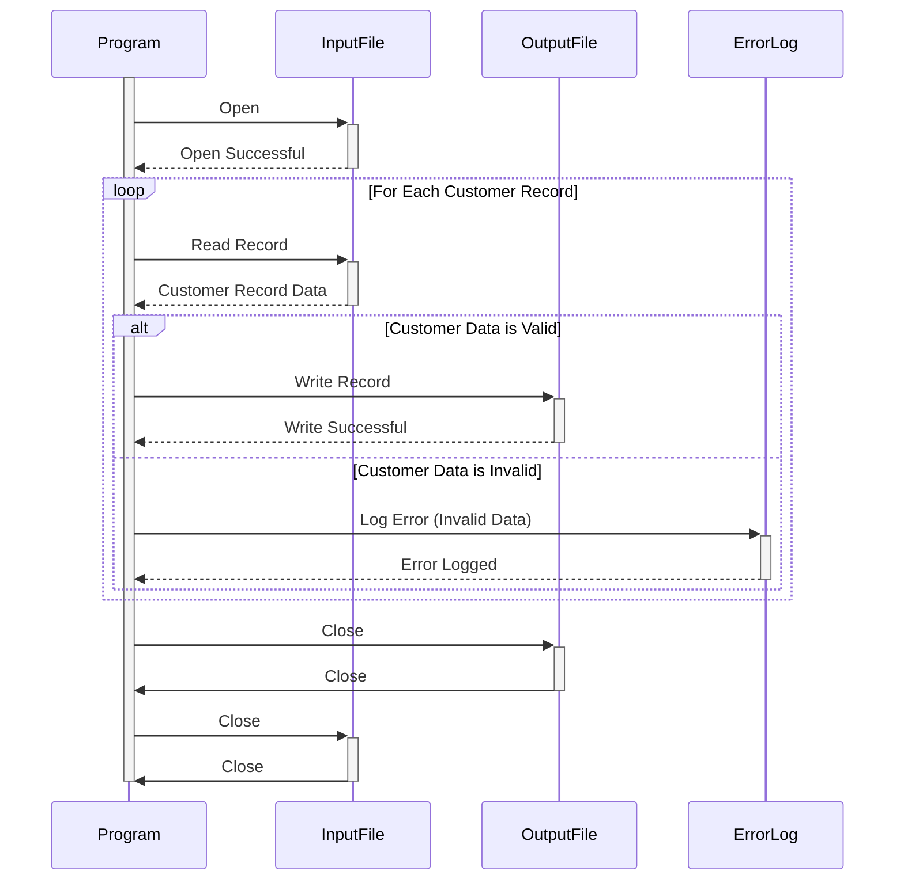

Generated at: 1st October of 2024

# **Title Document:** CardDemo - Customer Data Validation and Processing Program

## **Summary Description:**

This program focuses on ensuring the quality of customer data within the CardDemo system. It reads customer records from an input file, validates key information like names and addresses, and writes the valid records to an output file. Records that fail validation are logged for further review and correction. This process is crucial for maintaining accurate customer data, which is essential for various business operations like marketing, customer service, and reporting. 

## **User Stories:**

As a data analyst, I need to be sure that the customer data used for analysis is accurate and reliable. This program helps me by identifying and separating out any invalid customer records, ensuring that my analysis is based on trustworthy data.

## **Related Epic:**
8 - Customer Data Management

## **Functional Requirements:**

1. **Read Customer Records:** The program should be able to read customer records from a designated input file. The format of the input file should be consistent with the `CUSTOMER-RECORD` structure defined in the `CUSTREC.cpy` file.
2. **Validate Customer Data:**
    - **Name Validation:** The program should check that the first name, middle name (if provided), and last name fields are not blank and contain only alphabetic characters (spaces allowed).
    - **Address Validation:** The program should verify that the address fields are populated with valid data. This could involve checks against a known list of valid addresses or using a third-party address verification service.
    - **Other Validations:**  The program might need to perform additional data validations based on specific business rules. For example, it could check that the Social Security Number (SSN) field contains nine digits or that the FICO credit score falls within an acceptable range.
3. **Handle Invalid Records:**  
    - **Log Errors:**  If a record fails validation, the program should log the error details, including the customer ID, the field that failed validation, and a brief error message. This log can be used to identify and correct the invalid data in the source system.
    - **Exclude from Output:** Invalid records should not be written to the output file.
4. **Write Valid Records:**  
    - **Create Output File:** The program should create an output file to store the validated customer records.
    - **Maintain Structure:**  The output file should maintain the same `CUSTOMER-RECORD` structure as the input file, ensuring consistency in data organization.

## **Non-Functional Requirements:**

- **Performance:**  The program should be able to process large volumes of customer data efficiently. The processing time should be reasonable even for files containing millions of records.
- **Reliability:**  The program should be reliable and produce consistent results. It should be thoroughly tested to minimize the risk of errors or unexpected behavior.
- **Maintainability:** The program should be written in a clear and well-structured manner to facilitate future maintenance and enhancements.  
- **Security:** Access to the program, the input file, and the output file should be restricted to authorized personnel only. The program should handle sensitive data like SSNs and credit scores securely, following data privacy regulations and best practices.

## **Acceptance Criteria:**

- **Successful File Processing:** The program should successfully read all records from the input file.
- **Accurate Validation:**  The program should correctly validate all customer data according to the defined rules.
- **Comprehensive Error Handling:** All invalid records should be identified, and the errors should be appropriately logged.
- **Correct Output:** The output file should contain only valid customer records, and the data should be correctly formatted according to the `CUSTOMER-RECORD` structure.

## **Code Improvements:**

- **Modular Design:** Break down the validation logic into separate, reusable functions or modules. This will improve code organization and make it easier to add or modify validation rules in the future.
- **Configuration-Driven Validation:**  Allow validation rules to be defined externally through a configuration file. This would make it easier to update the validation criteria without modifying the program's code.
- **Improved Error Reporting:**  Provide more detailed error messages in the log, including the specific validation rule that failed.  
- **Performance Optimization:**  Explore techniques for optimizing the program's performance, especially when dealing with large input files. This might involve using efficient data structures, optimizing file I/O operations, or leveraging parallel processing capabilities.

## **Security Improvements:**

- **Data Encryption:** Encrypt sensitive data within the input, output, and log files to protect it from unauthorized access.
- **Secure Logging:** Implement secure logging practices to protect sensitive information that might be included in error logs. 
- **Access Control:**  Ensure that only authorized users have access to the program, its source code, and the data files it processes.

## **Conceptual Diagram:**

--Made by "Smart Engineering" (by Compass.UOL)--