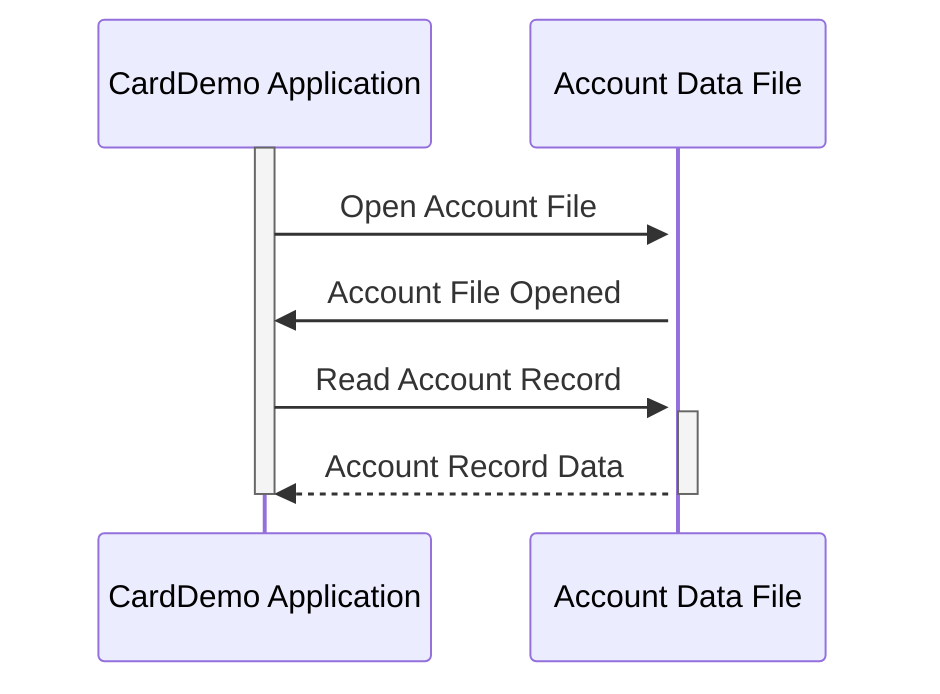

Generated at: 1st October of 2024

# **Title Document:** CardDemo Account Data Structure Specification

# **Summary Description:**

This document describes the data structure of customer account records within the CardDemo application. It outlines the information stored for each account, including identification, status, balance, credit limits, and other relevant details.

# **User Stories:**

As a credit card system administrator, I need a standardized way to store and access customer account information to ensure accurate transaction processing, account management, and reporting. 

# **Related Epic:**
2 - Account Management

# **Functional Requirements:**

The Account Record data structure shall include the following fields:

* **`ACCT-ID`:** A unique identifier for each account.
* **`ACCT-ACTIVE-STATUS`:** An indicator of the account's current status (e.g., Active, Inactive, Closed).
* **`ACCT-CURR-BAL`:** The current balance of the account.
* **`ACCT-CREDIT-LIMIT`:** The maximum credit line extended to the account holder.
* **`ACCT-CASH-CREDIT-LIMIT`:** The maximum amount of cash withdrawal allowed on the account.
* **`ACCT-OPEN-DATE`:** The date the account was opened.
* **`ACCT-EXPIRAION-DATE`:** The date the account is set to expire.
* **`ACCT-REISSUE-DATE`:** The date the account was last renewed or reissued.
* **`ACCT-CURR-CYC-CREDIT`:** The total credit transactions processed within the current billing cycle.
* **`ACCT-CURR-CYC-DEBIT`:** The total debit transactions processed within the current billing cycle.
* **`ACCT-ADDR-ZIP`:** The ZIP code associated with the account holder's address.
* **`ACCT-GROUP-ID`:**  A code identifying the account's group affiliation (if applicable).

# **Non-Functional Requirements:**

* **Data Integrity:** The system shall ensure the accuracy and consistency of account data through validation rules and data integrity checks.
* **Security:** Access to account information shall be restricted to authorized personnel only, following security protocols established by the organization.
* **Performance:** Retrieval and update operations on account records should be performed efficiently to ensure optimal system performance.

# **Acceptance Criteria:**

* The Account Record data structure shall be implemented as defined in this specification.
* All mandatory fields shall be populated with valid data.
* The system shall enforce data validation rules for each field to maintain data integrity.
* Access to account information shall be restricted to authorized users.
* Performance testing shall be conducted to ensure efficient data retrieval and update operations.

# **Code Improvements:**

* Implement data validation routines to ensure the accuracy of data entered into the account record.
* Add error handling mechanisms to gracefully handle any exceptions or errors during data processing.
* Document the data structure and its fields clearly to improve code readability and maintainability.

# **Security Improvements:**

* Encrypt sensitive account information, such as account numbers and credit card details, to protect against unauthorized access.
* Implement access control mechanisms to restrict data access based on user roles and permissions.
* Regularly audit the system to track data access and identify any potential security breaches.

# **Conceptual Diagram:**

--Made by "Smart Engineering" (by Compass.UOL)--