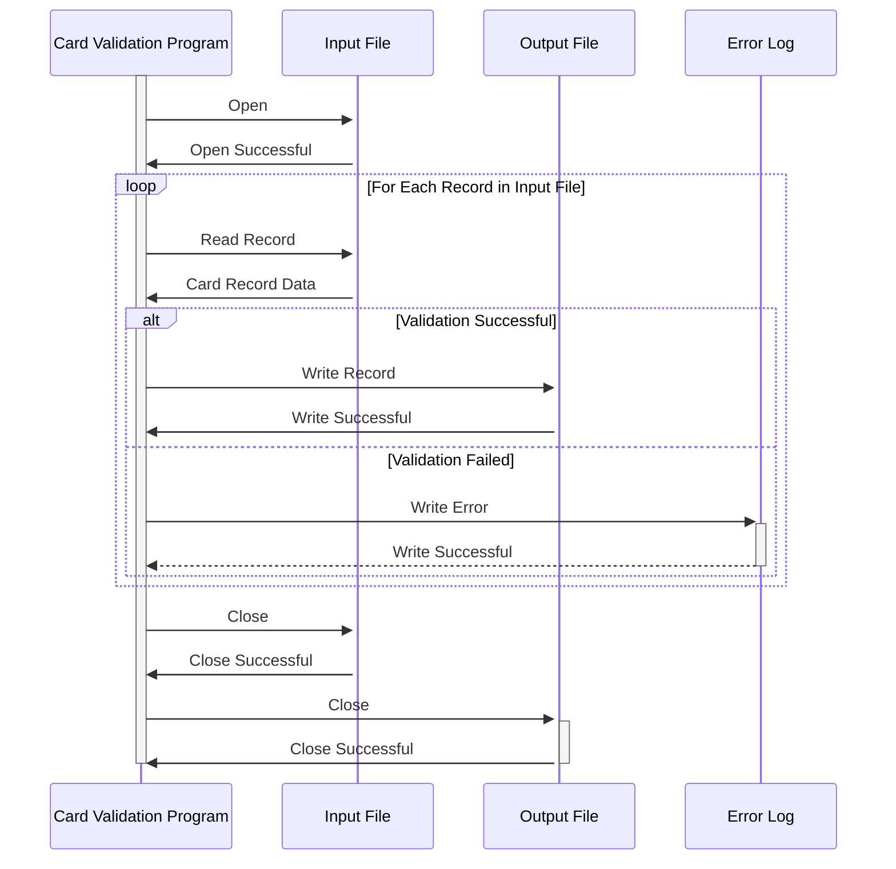

Generated at: 1st October of 2024

# **Title Document:** Card Data Validation and Processing Program

## **Summary Description:** 
This program validates credit card data from an input file and writes valid records to an output file. It plays a crucial role in ensuring data integrity for downstream processes like transaction processing, reporting, and account management.

## **User Stories:**
As a data analyst, I need to ensure that only valid credit card records are used for analysis and reporting to maintain data accuracy and reliability.

## **Related Epic:**
3 - Credit Card Management

## **Functional Requirements:**
1. **Read Card Data:** The program should read credit card records from an input file.
2. **Validate Card Number:** Validate the card number based on predefined rules (e.g., length, Luhn algorithm).
3. **Validate Expiration Date:** Verify if the card is not expired based on the current date.
4. **Validate Active Status:** Check if the card is marked as active.
5. **Handle Invalid Records:** If a record fails validation, log the error details (e.g., reason for failure, record details) to an error log.
6. **Write Valid Records:** Write validated card records to an output file for further processing.

## **Non-Functional Requirements:**
1. **Performance:** The program should process a high volume of card records efficiently within an acceptable timeframe.
2. **Reliability:** The program should operate reliably without errors or data corruption.
3. **Maintainability:** The program code should be well-structured, documented, and easy to understand for future modifications or enhancements.
4. **Security:** The program should handle sensitive card data securely and comply with relevant data protection regulations (e.g., PCI DSS).

## **Acceptance Criteria:**
1. The program successfully reads and validates credit card data from the input file.
2. Invalid records are identified, logged with specific error details, and excluded from the output file.
3. Valid card records are correctly written to the output file in the expected format.
4. The program handles errors gracefully, logs relevant information for troubleshooting, and provides clear error messages to the user.
5. The program meets the defined performance requirements, processing records within the acceptable timeframe.

## **Code Improvements:**
1. Implement a more robust error handling mechanism to catch and handle various exceptions (e.g., file not found, invalid data format).
2. Add logging for successful operations and key milestones in the processing flow to facilitate monitoring and troubleshooting.
3. Optimize the validation logic for improved performance, especially when dealing with a large volume of records.
4. Consider using a data validation library or framework to simplify and standardize the validation rules.

## **Security Improvements:**
1. Implement appropriate access controls to restrict unauthorized access to the program, input file, output file, and error logs.
2. Encrypt sensitive card data during processing and storage to protect it from unauthorized access.
3. Log all data access attempts, including user IDs and timestamps, for auditing and security monitoring purposes.
4. Regularly review and update security measures to address new vulnerabilities and threats.

## **Conceptual Diagram:**

--Made by "Smart Engineering" (by Compass.UOL)--