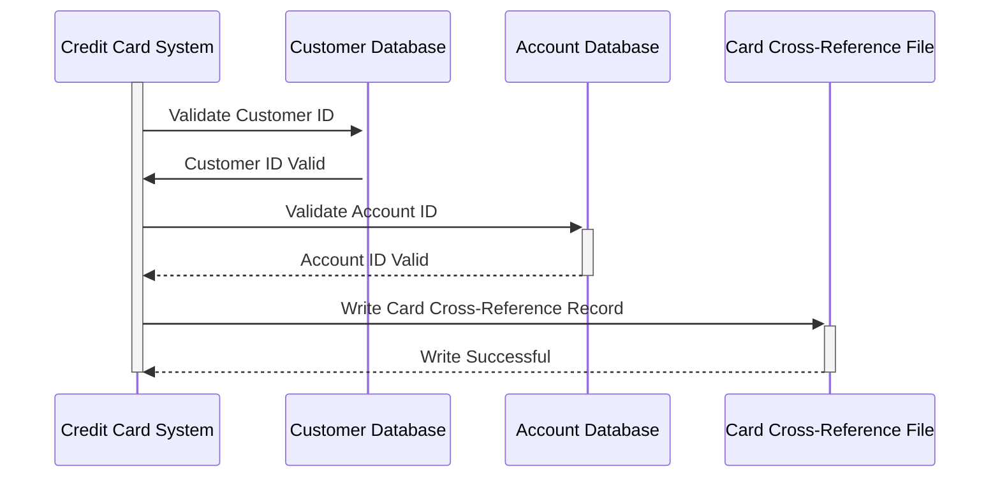

Generated at: 1st October of 2024

# **Title Document:** Credit Card Cross-Reference Data Specification

# **Summary Description:**
This document outlines the structure and function of the Card Cross-Reference Record within the Credit Card Management System. This record acts as a link between a credit card, its owner (the customer), and their associated account.

# **User Stories:**
As a credit card system administrator, I need to be able to link credit card numbers to customer and account information so that I can track transactions and manage accounts effectively. 

# **Related Epic:**
3 - Credit Card Management

# **Functional Requirements:**
The Card Cross-Reference Record should store the following information:

* **Credit Card Number:** A 16-digit number that uniquely identifies the credit card.
* **Customer ID:** A unique identifier for the customer who owns the credit card.
* **Account ID:** A unique identifier for the account associated with the credit card.

# **Non-Functional Requirements:**
* **Data Integrity:** The system should ensure that the Card Cross-Reference Record is accurate and up-to-date. This includes validating the credit card number, customer ID, and account ID against the respective databases.
* **Performance:** The system should be able to retrieve Card Cross-Reference Records quickly and efficiently, as this is a critical component of many credit card operations.
* **Security:** The Card Cross-Reference Record contains sensitive information, so it is important to secure it from unauthorized access.

# **Acceptance Criteria:**
* The Card Cross-Reference Record should be successfully created and populated with the correct information when a new credit card is issued.
* The system should be able to retrieve Card Cross-Reference Records by credit card number, customer ID, or account ID.
* The system should prevent duplicate Card Cross-Reference Records from being created.

# **Code Improvements:**
* Add data validation checks to ensure that the credit card number, customer ID, and account ID are valid.
* Implement a logging mechanism to track all changes to the Card Cross-Reference Record.
* Create a user interface or API to allow authorized users to view and manage Card Cross-Reference Records.

# **Security Improvements:**
* Encrypt the Card Cross-Reference Record to protect it from unauthorized access.
* Implement access control measures to restrict access to the Card Cross-Reference Record to authorized users only.
* Regularly audit the Card Cross-Reference Record to ensure that it is being accessed and used appropriately.

# **Conceptual Diagram:**

--Made by "Smart Engineering" (by Compass.UOL)--