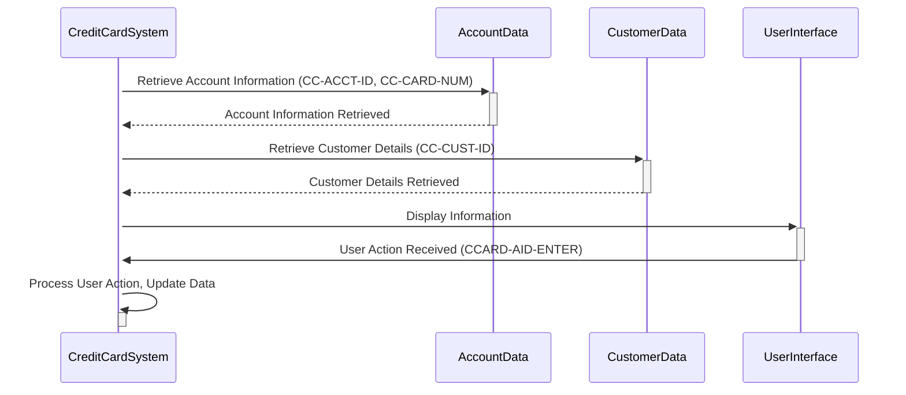

Generated at: 1st October of 2024

# **Title Document:** Credit Card System - Data Structure for Credit Card Operations

# **Summary Description:**
This document details the data structure used in a credit card system, focusing on how credit card account information, customer details, and user interactions are stored and accessed. This structure is defined in the CVCRD01Y copybook, which acts as a blueprint for organizing this information within the system.

# **User Stories:**
As a Credit Card System user, I need a standardized way to store and access credit card account information, customer details, and track user interactions to ensure efficient and accurate processing of credit card operations.

# **Related Epic:**
3 - Credit Card Management

# **Functional Requirements:**
* **Account Identification:** The system must be able to uniquely identify each credit card account. This is done using a unique identifier stored in the `CC-ACCT-ID` data item.
* **Card Number Management:** The system must be able to store and process credit card numbers. The `CC-CARD-NUM` data item is used for this purpose, and it can be treated as both text and numerical data.
* **Customer Association:** The system should link credit card information to a specific customer. This is achieved by storing a unique customer identifier in the `CC-CUST-ID` data item.
* **User Interface Interaction:** The system needs to handle user interactions, such as key presses. Data items like `CCARD-AID-ENTER` and `CCARD-AID-CLEAR` likely represent actions like pressing "Enter" or "Clear" keys.
* **Program Flow Control:** The system must manage the flow of operations, such as navigating between different programs or screens. Data items like `CCARD-LAST-PROG` and `CCARD-NEXT-PROG` likely store the names of programs involved in this flow.

# **Non-Functional Requirements:**
* **Performance:** Accessing and retrieving data from the data structure should be fast and efficient to avoid impacting system performance.
* **Maintainability:** The data structure should be well-organized and documented to facilitate maintenance and updates.
* **Scalability:** The design of the data structure should allow for future expansion and the addition of new data elements without requiring significant code changes.

# **Acceptance Criteria:**
* The data structure accurately represents credit card account information, customer details, and user interactions as defined in the requirements.
* The system can successfully store and retrieve data using this structure.
* The data structure integrates seamlessly with other parts of the credit card system.

# **Code Improvements:**
* **Data Validation:** Implement checks to ensure the validity of data being stored in the structure. For instance, credit card numbers should be validated using a checksum algorithm.
* **Documentation:** Add clear comments to explain the purpose of each data item and how it's used within the system.
* **Standardization:**  If possible, align the data structure with any industry standards for data exchange or storage to improve interoperability with other systems.

# **Security Improvements:**
* **Data Encryption:** Encrypt sensitive data, such as credit card numbers, to protect it from unauthorized access.
* **Access Control:** Implement mechanisms to restrict access to the data structure and its elements based on user roles and permissions.
* **Audit Logging:** Track all accesses and modifications to the data structure for auditing and security purposes.

# **Conceptual Diagram:**

--Made by "Smart Engineering" (by Compass.UOL)--