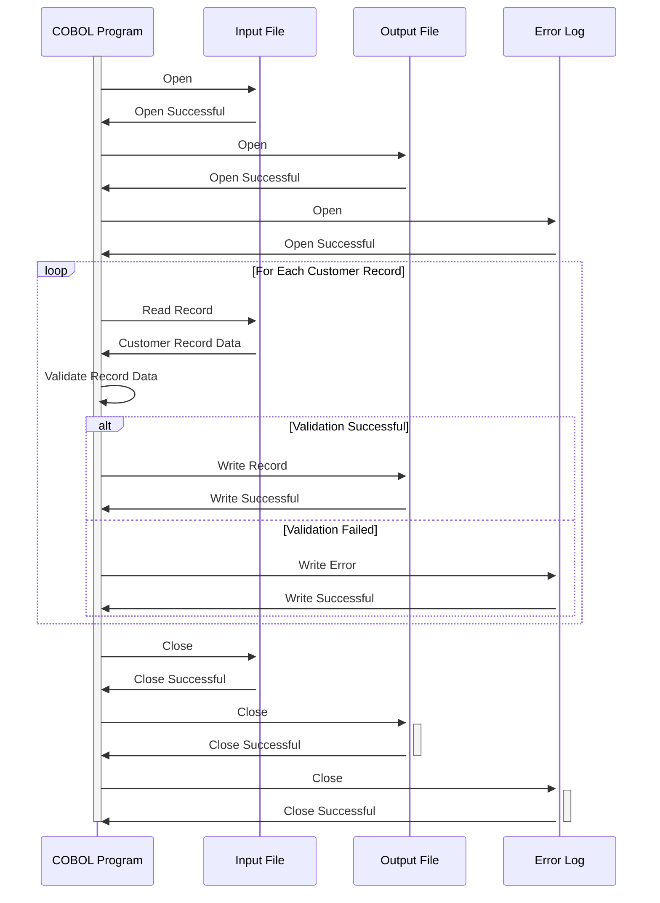

Generated at: 1st October of 2024

# **Title Document:** Customer Data Validation and Processing Program

## **Summary Description:**

This program validates customer data from an input file. It checks the format and content of each field in the customer record, ensuring data integrity. Only valid records are written to an output file, while invalid records are logged for review and correction.

## **User Stories:**

As a data analyst, I need to ensure that only valid and consistent customer data is used for analysis and reporting. This program helps me achieve that by automatically validating data and isolating any incorrect records.

## **Related Epic:**
8 - Customer Data Management

## **Functional Requirements:**

1. **Read Customer Records:** The program reads customer records from an input file. The file format and record layout are defined in the CVCUS01Y copybook.

2. **Validate Data Fields:** The program validates each field in the customer record according to the following rules:
    - **CUST-ID:**
        - Must be a numeric value.
        - Must be unique (no duplicate customer IDs allowed).
    - **CUST-FIRST-NAME, CUST-MIDDLE-NAME, CUST-LAST-NAME:**
        - Must contain only alphabetic characters (A-Z, a-z) and spaces.
        - Must not exceed the maximum field length.
    - **CUST-ADDR-LINE-1, CUST-ADDR-LINE-2, CUST-ADDR-LINE-3:**
        - Must not exceed the maximum field length.
    - **CUST-ADDR-STATE-CD:**
        - Must be a valid two-letter US state code (e.g., CA, NY).
    - **CUST-ADDR-COUNTRY-CD:**
        - Must be a valid three-letter country code (e.g., USA, CAN).
    - **CUST-ADDR-ZIP:**
        - Must be a valid five-digit or nine-digit ZIP code.
    - **CUST-PHONE-NUM-1, CUST-PHONE-NUM-2:**
        - Must be a valid phone number format (e.g., (XXX) XXX-XXXX).
    - **CUST-SSN:**
        - Must be a nine-digit numeric value.
        - Must be unique (no duplicate SSNs allowed).
    - **CUST-GOVT-ISSUED-ID:**
        - Must not exceed the maximum field length.
    - **CUST-DOB-YYYY-MM-DD:**
        - Must be a valid date in YYYY-MM-DD format.
        - Must represent a date in the past.
    - **CUST-EFT-ACCOUNT-ID:**
        - Must not exceed the maximum field length.
    - **CUST-PRI-CARD-HOLDER-IND:**
        - Must be a single character, either 'Y' (Yes) or 'N' (No).
    - **CUST-FICO-CREDIT-SCORE:**
        - Must be a numeric value between 300 and 850.

3. **Handle Invalid Records:** If any validation rule fails for a record:
    - The entire record is flagged as invalid.
    - An error message is logged, specifying the record details and the validation rule that failed.
    - The invalid record is not written to the output file.

4. **Write Valid Records:** If all validation rules pass for a record:
    - The record is written to the output file.
    - The output file uses the same format and record layout as the input file, ensuring consistency.

5. **Logging:** The program maintains a log file that records:
    - The start and end time of the validation process.
    - The number of records processed.
    - The number of valid records written to the output file.
    - The number of invalid records encountered.
    - Detailed error messages for each invalid record, including the specific validation rule that failed.

## **Non-Functional Requirements:**

- **Performance:** The program should process large input files (e.g., millions of records) efficiently within a reasonable time frame.
- **Reliability:** The program should be robust and handle unexpected errors gracefully without crashing or corrupting data.
- **Maintainability:** The code should be well-structured, documented, and easy to understand and modify for future enhancements.
- **Security:**
    - The program should have appropriate access controls to prevent unauthorized access to sensitive customer data (e.g., SSN).
    - Consider implementing data encryption for sensitive fields at rest and in transit.
    - Log all data access attempts for auditing purposes.

## **Acceptance Criteria:**

- The program successfully reads and processes all customer records from the input file.
- All data validation rules are implemented correctly, and the program accurately identifies invalid records.
- Only valid records are written to the output file, maintaining data integrity.
- Invalid records are logged with detailed error messages, facilitating data correction.
- The program handles large input files efficiently and completes processing within an acceptable time frame.
- The program is robust and handles unexpected errors gracefully, logging them for troubleshooting.

## **Code Improvements:**

- Implement a modular design with separate functions or subroutines for each validation rule. This improves code readability, maintainability, and testability.
- Use descriptive variable names and add comments to explain the logic behind validation rules.
- Implement error handling for file operations (e.g., opening, reading, writing, closing) to prevent data loss and improve program reliability.

## **Security Improvements:**

- Implement access controls to restrict program execution and data access to authorized personnel only.
- Consider encrypting sensitive data fields (e.g., SSN, EFT account ID) at rest and in transit to protect customer privacy.
- Implement logging for all data access attempts, including user ID, timestamp, and actions performed. This helps track potential data breaches and ensures accountability.

## **Conceptual Diagram:**

--Made by "Smart Engineering" (by Compass.UOL)--