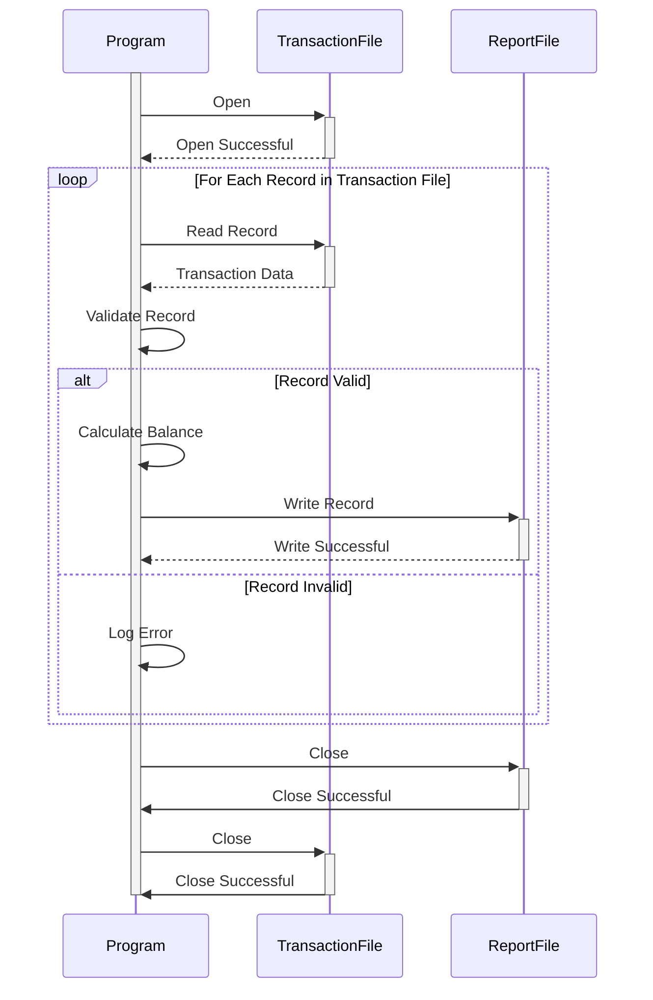

Generated at: 1st October of 2024

**Title Document:** Transaction Category Balance Report Program Specification

**Summary Description:** This program extracts, processes, and summarizes transaction category balance information for financial reporting and analysis.

**User Stories:** As a financial analyst, I need to access and analyze transaction category balances to generate accurate financial reports and gain insights into spending patterns.

**Related Epic:** 4 - Transaction Processing

**Functional Requirements:**
1. **Data Extraction:**
   - Read transaction records from the input file (`TRAN-CAT-BAL-RECORD`).
2. **Data Validation:**
   - Validate `TRANCAT-ACCT-ID` against existing account records.
   - Validate `TRANCAT-TYPE-CD` against a predefined list of valid transaction types.
   - Validate `TRANCAT-CD` to ensure it aligns with defined transaction categories.
3. **Balance Calculation:**
   - Calculate the balance for each unique combination of `TRANCAT-ACCT-ID`, `TRANCAT-TYPE-CD`, and `TRANCAT-CD`.
4. **Reporting:**
   - Generate a report summarizing the balance for each transaction category.
   - The report should include:
     - Account ID
     - Transaction Type Code
     - Transaction Category Code
     - Balance

**Non-Functional Requirements:**
- **Performance:** The program should process large volumes of transaction data efficiently.
- **Reliability:** The program should be reliable and produce accurate results consistently.
- **Maintainability:** The code should be well-structured, documented, and easy to maintain.
- **Security:** Access to sensitive financial data should be restricted to authorized personnel.

**Acceptance Criteria:**
- The program successfully extracts and validates transaction category balance data.
- The program accurately calculates and reports balances for each transaction category.
- The program handles errors gracefully and provides informative error messages.
- The program meets performance requirements for processing large datasets.

**Code Improvements:**
- Implement logging for better tracking and debugging.
- Introduce error handling for potential data inconsistencies or file access issues.
- Optimize the balance calculation algorithm for improved performance.
- Add comments to the code to improve readability and maintainability.

**Security Improvements:**
- Implement access controls to restrict data access to authorized users.
- Encrypt sensitive financial data both in transit and at rest.
- Log all data access attempts for auditing purposes.

**Conceptual Diagram:**

--Made by "Smart Engineering" (by Compass.UOL)--