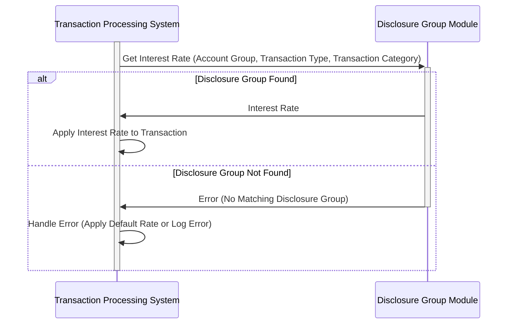

Generated at: 1st October of 2024

# **Title Document:** CardDemo - Disclosure Group Structure Specification

# **Summary Description:**

This document describes the "Disclosure Group" structure within the CardDemo application. This structure is used to determine the interest rate applied to credit card transactions based on the account type, transaction type, and transaction category. 

# **User Stories:**

As a financial analyst, I need to ensure that the system applies the correct interest rates to different types of credit card transactions so that we can accurately calculate interest income and customer statements.

# **Related Epic:**
3 - Credit Card Management

# **Functional Requirements:**

1. **Define Disclosure Group:** The system should allow the definition of a Disclosure Group with a unique combination of Account Group, Transaction Type, and Transaction Category.
2. **Assign Interest Rate:** Each Disclosure Group should have an associated interest rate.
3. **Retrieve Interest Rate:** The system should be able to retrieve the correct interest rate for a transaction based on its associated Disclosure Group.

**Business Rules:**

* **Unique Disclosure Group:** The system should ensure that each combination of Account Group, Transaction Type, and Transaction Category is unique within the Disclosure Group structure.
* **Valid Interest Rate:** The system should validate that the interest rate assigned to a Disclosure Group is a valid numerical value and falls within a predefined acceptable range.
* **Transaction Interest Rate Determination:**
    * When a transaction occurs, the system should determine the applicable interest rate by matching the transaction's Account Group, Transaction Type, and Transaction Category with the corresponding Disclosure Group.
    * If a matching Disclosure Group is found, the system applies the associated interest rate to the transaction.
    * If no matching Disclosure Group is found, the system should either apply a default interest rate or trigger an error condition, depending on the business rule.

# **Non-Functional Requirements:**

* **Performance:** The interest rate retrieval based on the Disclosure Group should be fast and efficient to avoid impacting transaction processing times.
* **Maintainability:**  The structure should be easily maintainable, allowing for the addition, modification, or deletion of Disclosure Groups and their associated interest rates.
* **Auditability:** All changes to the Disclosure Group structure, including the creation, modification, and deletion of groups and interest rates, should be logged for audit purposes.

# **Acceptance Criteria:**

* The system successfully defines and stores Disclosure Groups with unique combinations of Account Group, Transaction Type, and Transaction Category.
* The system correctly retrieves the assigned interest rate for a given Disclosure Group.
* The system applies the correct interest rate to transactions based on their associated Disclosure Group.
* All changes made to Disclosure Groups are logged and auditable.

# **Code Improvements:**

* **Error Handling:** Implement robust error handling for scenarios like invalid interest rate inputs and attempts to create duplicate Disclosure Groups.
* **Data Validation:** Add data validation checks to ensure the integrity of data stored in the Disclosure Group structure, such as validating the format of Account Group, Transaction Type, and Transaction Category codes.
* **Code Comments:** Add clear and concise comments to the code to improve readability and understanding of the Disclosure Group structure and its usage.

# **Security Improvements:**

* **Access Control:** Implement appropriate access control measures to restrict modification of Disclosure Groups and interest rates to authorized personnel only.
* **Data Encryption:** Consider encrypting sensitive data within the Disclosure Group structure, particularly the interest rates, to protect against unauthorized access.

# **Conceptual Diagram:**

--Made by "Smart Engineering" (by Compass.UOL)--